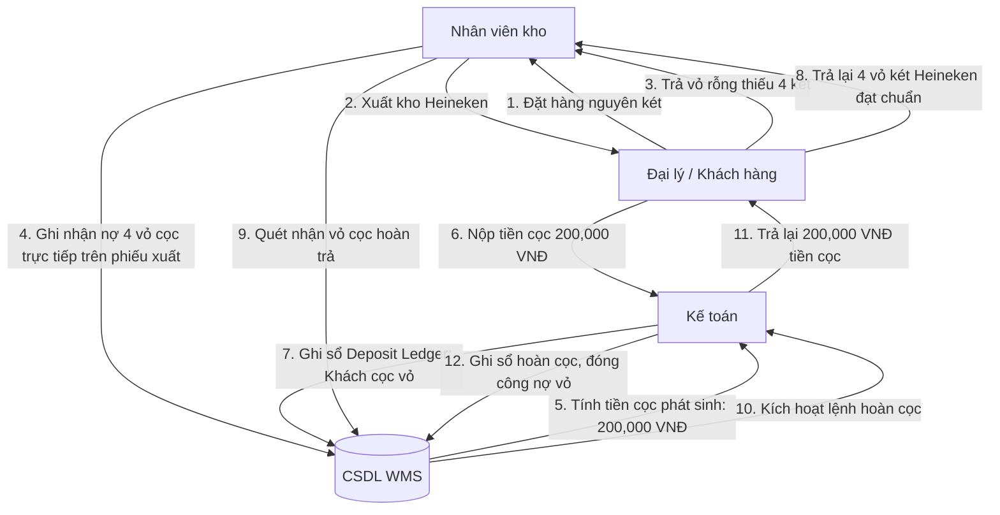

# BẢN ĐẶC TẢ CẤU TRÚC GIAO DIỆN (UI SKELETON) CHI TIẾT - TỐI ƯU THEO NGHIỆP VỤ THỰC TẾ
> **Phiên bản:** 3.5 - Bổ sung chi tiết phân hệ Biểu đồ Gantt Tiến độ giao hàng (Lead Time) và Biểu đồ ROP & Lead Time Demand phục vụ đặt hàng tự động.  
> **Mục tiêu:** Cung cấp dữ liệu sườn đầu vào hoàn chỉnh cho Google's Stitch để dựng giao diện.

---

## 1. TRANG CHỦ KHI CHƯA ĐĂNG NHẬP (PRE-LOGIN HOMEPAGE)

Giao diện đăng nhập trực quan, hiển thị trạng thái vận hành của hệ thống theo thời gian thực để nhân viên và quản lý nắm bắt trước khi bắt đầu ca làm việc.

### Các thành phần chính trên màn hình (Layout Skeleton):
1. **Header / Navigation Bar**:
   - Logo thương hiệu WMS (góc trái).
   - **System Status Light**: Đèn xanh báo trạng thái hệ thống (*API Health: Online*, *DB Sync: OK*, *Last Backup: 15 mins ago*).
2. **Widget Đăng Nhập & Phân Vùng**:
   - **Username / Password Input**: Ô nhập liệu có nút hiển thị mật khẩu dạng mắt nhắm/mở.
   - **Lựa chọn Kho làm việc (Warehouse Selector)**: Dropdown liệt kê các kho vật lý được quyền truy cập. *Bắt buộc nhân viên chọn kho khi đăng nhập để tự động lọc dữ liệu và áp dụng phân quyền phạm vi.*
   - **MFA Challenge**: Trường nhập mã xác thực OTP 6 số (chỉ hiển thị sau khi nhập đúng mật khẩu đối với tài khoản Quản lý/Kế toán/Admin).
3. **Bảng tin kỹ thuật (System Bulletin)**:
   - Thông báo lịch bảo trì hệ thống hoặc cập nhật chính sách kiểm kho.

---

## 2. THIẾT KẾ CHI TIẾT CÁC MÀN HÌNH CHỨC NĂNG THEO VAI TRÒ (ACTORS)

### 2.1. Nhân Viên Kho (Warehouse Staff)
*Giao diện tối ưu hóa cho màn hình di động/máy tính bảng cầm tay và thiết bị quét barcode.*

#### Màn hình Nhập kho (Goods Receipt Detail Screen)
*   **Khu vực Thông tin chung**: Số PO tham chiếu, Nhà cung cấp, Người thực hiện, Ngày nhận hàng.
*   **Khu vực Chi tiết Dòng hàng hóa**:
    *   Cột SKU & Tên sản phẩm.
    *   Cột Nhập số lượng: **[Nhập số Thùng/Két thực nhận]** (Chỉ nhận số nguyên).
    *   **Hiển thị quy đổi song song tự động (Real-time Unit Conversion):** Hiển thị ngay bên cạnh số lượng quy đổi ra Lon/Chai để nhân viên kho đối soát nhanh khi kiểm đếm từ xe tải.  
        *Ví dụ:* Nhập `10 Thùng` -> Hệ thống hiển thị mờ bên cạnh: `(Quy đổi: 240 Lon 330ml)`.
    *   Ô nhập bắt buộc: **Mã Lô (Batch Code)**, **Ngày sản xuất (MFG)**, **Hạn sử dụng (EXP)**.
    *   Nút chụp ảnh đính kèm (để làm bằng chứng đối soát khi hàng móp méo/vỡ).
*   **Khu vực Bao bì hoàn trả & Tiền cọc trực tiếp trên phiếu (Returnable Packaging & Deposit)**:
    *   **[Số lượng vỏ cọc thu hồi thực tế]**: Nhập số két nhựa/vỏ chai rỗng/pallet thực nhận lại từ xe giao hàng.
    *   **[Số nợ vỏ phát sinh]**: Hệ thống tự động tính toán chênh lệch (Vỏ cọc đi kèm hàng nhập - Vỏ rỗng trả lại).
    *   **[Tiền cọc phát sinh dự kiến]**: Số nợ vỏ × Đơn giá cọc (ví dụ: *4 két nợ x 50.000đ = 200.000 VNĐ*).

#### Màn hình Pick hàng xuất kho (Picking & Goods Issue Screen)
*   **Khu vực Chỉ dẫn vị trí**: Danh sách các dòng hàng cần lấy sắp xếp ưu tiên theo FEFO (Hạn dùng gần nhất lấy trước), hiển thị rõ: **Mã Ô kệ (Location)**, **Số lô cần lấy**, **Số lượng Thùng/Két cần lấy (kèm số lon quy đổi)**.
*   **Cơ chế Quét Xác Nhận (Scan-to-Confirm)**: Nhân viên quét mã vạch vị trí ô kệ và quét mã vạch SKU để xác nhận lấy hàng thành công.

---

### 2.2. Quản Lý (Manager)

Nhằm tối ưu hóa thời gian và quy trình vận hành, Quản lý được hỗ trợ cả **hai phương thức phê duyệt**:

#### 1. Trung tâm phê duyệt tập trung (Centralized Approval Center)
*   Màn hình gom tất cả các yêu cầu phê duyệt từ toàn hệ thống vào một bảng điều khiển duy nhất.
*   Phân loại theo tab:
    *   **Tab Đơn mua hàng (PO)**: Xem nhanh danh sách các PO đang chờ duyệt để đặt hàng.
    *   **Tab Điều chỉnh tồn kho (Stock Adjustments)**: Các chênh lệch kiểm kê vượt hạn mức của nhân viên kho gửi lên.
    *   **Tab Ngoại lệ MRSL & FEFO**: Yêu cầu nhận hàng cận hạn hoặc xuất hàng đè quy tắc FEFO.
*   Hỗ trợ nút **[Phê duyệt hàng loạt]** (Batch Approve) sau khi tích chọn nhiều dòng hoặc mở xem chi tiết từng yêu cầu trước khi phê duyệt/từ chối kèm lý do.

#### 2. Phê duyệt trực tiếp tại phiếu (Inline Approval)
*   Khi Quản lý mở chi tiết một chứng từ cụ thể (ví dụ: chi tiết phiếu PO mã `PO-2026-0001`), góc trên bên phải màn hình sẽ hiển thị trực tiếp các nút hành động nổi bật: **[Phê duyệt]**, **[Từ chối]** kèm ô nhập **[Lý do phê duyệt/từ chối]**.

---

### 2.3. Nhân Viên Bán Hàng (Sales Staff)

#### Màn hình Tra cứu tồn kho khả dụng (ATP Viewer Screen)
*   Bảng hiển thị danh sách SKU đi kèm 3 cột số liệu song song để bán hàng chính xác:
    *   **Tồn vật lý sẵn có (Sellable On-hand)**: Tổng lượng hàng Available trong kho.
    *   **Hàng đã giữ chỗ (Active Reservation)**: Lượng hàng đã cam kết cho các đơn bán hàng khác đang chờ xuất.
    *   **Tồn khả dụng bán (ATP)**: Số lượng thực tế có thể chào bán cho khách mới (`ATP = Sellable On-hand - Active Reservation`).
*   Hỗ trợ cột **Quy đổi ra lon/chai** bên cạnh số Thùng/Két để nhân viên tư vấn dễ dàng báo giá chi tiết.

---

### 2.4. Nhân Viên Kế Toán (Accountant)

#### Màn hình Đối soát Bao bì & Tiền cọc (Deposit & Packaging Ledger)
*   **Bảng theo dõi theo Đối tác (Đại lý/Nhà cung cấp)**:
    *   Cột thông tin Đại lý.
    *   Cột **[Tổng két nhựa đang nợ]**, **[Tổng vỏ chai đang nợ]**, **[Tổng pallet đang nợ]**.
    *   Cột **[Số tiền cọc tương ứng đang giữ]** (VNĐ).
*   **Danh sách lịch sử biến động vỏ cọc**: Xem chi tiết từng lần xuất hàng/trả vỏ để đối chiếu số liệu khi thanh toán công nợ hoặc trả cọc cho đại lý.

---

## 3. PHÂN HỆ BÁO CÁO SỐ LIỆU & THỐNG KÊ TÀI CHÍNH CHI TIẾT (REPORTING & FINANCIAL STATS)

Phân hệ báo cáo được thiết kế trực quan hóa tối đa để Ban Giám đốc và bộ phận Kế toán dễ dàng đánh giá hiệu quả tài chính và vận hành kho:

### 3.1. Nhóm Báo Cáo Tồn Kho & Chất Lượng (Inventory & Quality Reports)
1.  **Biểu đồ Tồn Kho Tổng Hợp (Real-time Inventory Balance Chart)**:
    *   *Trực quan hóa:* Biểu đồ cột chồng (Stacked Bar Chart).
    *   *Dữ liệu hiển thị:* Phân rã tổng tồn kho của doanh nghiệp thành:
        *   `Sellable On-hand` (Hàng sẵn sàng bán - Available).
        *   `Active Reservation` (Hàng đã giữ chỗ cho đơn hàng).
        *   `ATP` (Hàng còn có thể cam kết bán mới).
        *   `Quarantined` (Hàng đang bị cách ly kiểm định).
        *   `Damaged/Expired` (Hàng hỏng/hết hạn đang chờ tiêu hủy).
        *   `In-transit` (Hàng đang đi trên đường giữa các kho).
2.  **Báo cáo Cận Hạn Sử Dụng (Shelf-life & Expiration Alert Report)**:
    *   *Trực quan hóa:* Biểu đồ tròn phân đoạn (Donut Chart) kết hợp danh sách bảng.
    *   *Dữ liệu hiển thị:* Tỷ lệ phần trăm hàng tồn kho theo Hạn sử dụng còn lại:
        *   Nguy hiểm: Hết hạn (`EXP < Current Date` - Chữ màu Đỏ).
        *   Khẩn cấp: Dưới 30 ngày (Chữ màu Cam).
        *   Cận hạn: 31 - 90 ngày (Chữ màu Vàng).
        *   An toàn: Trên 90 ngày (Chữ màu Xanh).
3.  **Báo cáo Kiểm kê & Điều chỉnh (Stocktake Variance Report)**:
    *   Bảng đối chiếu chênh lệch giữa số lượng đếm thực tế và số lượng lý thuyết trên hệ thống.
    *   Hiển thị giá trị chênh lệch (âm/dương), lý do điều chỉnh và người phê duyệt bút toán điều chỉnh.

---

### 3.2. Báo cáo Vận Hành FMCG (FMCG Operations Metrics)
1.  **Báo cáo Đánh giá Nhà cung cấp (Supplier KPI & Lead Time Dashboard)**:
    *   **OTD (On-Time Delivery Rate)**: Tỷ lệ giao hàng đúng hẹn của nhà cung cấp.
    *   **Average Lead Time**: Thời gian giao hàng trung bình từ lúc gửi PO đến khi nhận hàng (Phân tách rõ thời gian nhận lô đầu tiên và thời gian nhận hoàn tất đơn hàng).
    *   **Fill Rate**: Tỷ lệ hoàn thành đơn hàng (lượng thực nhận so với lượng đặt, giới hạn tối đa 100%).
    *   **Damage/Return Rate**: Tỷ lệ hàng hỏng hoặc hàng bị trả lại quy trách nhiệm cho nhà cung cấp.
2.  **Báo cáo Hiệu quả FEFO & Ghi Đè (FEFO Exception Audit Report)**:
    *   Thống kê số lần nhân viên thực hiện xuất hàng ghi đè quy tắc FEFO (xuất lô hạn xa hơn lô hạn gần).
    *   Hiển thị chi tiết: Mã nhân viên thực hiện, người phê duyệt ngoại lệ và lý do ghi đè bắt buộc (ví dụ: *Yêu cầu đặc biệt từ kênh siêu thị lớn*).

---

### 3.3. Chi tiết phân hệ thống kê tài chính kho (Detailed Financial Stats)

Dưới đây là đặc tả chi tiết cấu trúc bảng dữ liệu (Data Grid Columns) và công thức tính toán cho các báo cáo tài chính kho chuyên sâu:

#### 1. Báo cáo Giá trị Tài sản Tồn kho (Inventory Valuation & Costing Report)
*   **Mục đích:** Xác định chính xác tổng số tiền đang bị đọng ở kho hàng theo từng thời điểm để kế toán lập báo cáo tài sản.
*   **Phương pháp tính:** **Giá vốn bình quân di động (Moving Average Cost)**.
*   **Các cột dữ liệu của bảng (Data Grid Columns):**
    1.  `Mã SKU` | `Tên SKU` (Ví dụ: *Tiger Lon 330ml - Thùng 24*)
    2.  `Thương hiệu` (Ví dụ: *Tiger*)
    3.  `Đơn vị lưu kho cơ sở` (Ví dụ: *Thùng*)
    4.  `Số lượng On-hand (Thùng)`
    5.  `Quy đổi Lon/Chai` *(Tự động nhân hệ số quy đổi tĩnh)*
    6.  `Giá mua gốc bình quân` (Đơn giá mua bình quân từ Nhà cung cấp trên các PO)
    7.  `Chi phí mua phân bổ` (Tổng chi phí vận chuyển, bốc dỡ phân bổ trên mỗi đơn vị thùng hàng)
    8.  `Đơn giá vốn bình quân di động (Unit Cost)` = `Giá mua gốc` + `Chi phí phân bổ`
    9.  `Tổng giá trị tồn kho (VNĐ)` = `Số lượng On-hand` × `Unit Cost`
    10. `Phân rã giá trị theo trạng thái chất lượng`:
        *   *Giá trị hàng khả dụng (Available Value)* (VNĐ)
        *   *Giá trị hàng cách ly (Quarantine Value)* (VNĐ)
        *   *Giá trị hàng hỏng/hết hạn (Expired/Damaged Value)* (VNĐ)
*   **Bộ lọc trực quan (Filters):** Lọc theo Kho vật lý, Kho cách ly, Kho hàng lỗi, theo Thương hiệu, hoặc phân nhóm theo tuổi hàng tồn kho (Inventory Aging - ví dụ: hàng đã nằm trong kho > 90 ngày).

#### 2. Báo cáo Biến Động Công Nợ Bao Bì & Tiền Cọc (Returnable Packaging & Deposit Liability)
*   **Mục đích:** Theo dõi số lượng vỏ két/vỏ chai/pallet cọc luân chuyển ngoài thị trường và nghĩa vụ tài chính đi kèm.
*   **Các cột dữ liệu của bảng (Data Grid Columns):**
    1.  `Mã Đối tác` | `Tên Đối tác` (Đại lý, Khách hàng sỉ, hoặc Nhà cung cấp)
    2.  `Loại bao bì hoàn trả` (Két nhựa Tiger, Két Heineken, Pallet gỗ, Keg Inox)
    3.  `Số dư vỏ đầu kỳ` (Số lượng vỏ đối tác đang nợ từ kỳ trước)
    4.  `Số lượng vỏ xuất đi trong kỳ` (Đi kèm hàng bán)
    5.  `Số lượng vỏ thu hồi trong kỳ` (Vỏ rỗng khách trả lại)
    6.  `Số lượng vỏ báo mất/hỏng khấu trừ` (Vỏ đối tác làm mất/hỏng và đồng ý bồi thường)
    7.  `Số dư vỏ cuối kỳ` = `Đầu kỳ` + `Xuất đi` - `Thu hồi` - `Báo mất/hỏng` (Số lượng vỏ đối tác đang còn nợ)
    8.  `Đơn giá cọc định mức` (Giá trị quy định cho mỗi két/vỏ chai cọc, ví dụ: *50.000đ/két nhựa*)
    9.  `Nghĩa vụ tiền cọc đầu kỳ (VNĐ)` (Số tiền cọc doanh nghiệp đang giữ của khách hàng)
    10. `Tiền cọc phát sinh trong kỳ (VNĐ)`
    11. `Tiền cọc hoàn trả trong kỳ (VNĐ)` (Hoàn trả khi thu hồi vỏ rỗng đạt chuẩn)
    12. `Giá trị bồi thường vỏ hỏng/mất (VNĐ)` (Khấu trừ trực tiếp vào tiền cọc)
    13. `Số dư tiền cọc cuối kỳ (VNĐ)` = `Đầu kỳ` + `Phát sinh` - `Hoàn trả` - `Khấu trừ`
*   **Cảnh báo thông minh (Alert System):** Cảnh báo các đối tác nợ vỏ vượt quá thời hạn quy định (ví dụ: giao két quá 30 ngày chưa trả vỏ rỗng).

#### 3. Báo cáo Đối soát Mua hàng & Chênh lệch Giá (PO-GR Price & Qty Variance Report)
*   **Mục đích:** Đối soát tài chính giữa phòng Mua hàng và Kho để xác định số tiền thực tế phải thanh toán cho Nhà cung cấp.
*   **Các cột dữ liệu của bảng (Data Grid Columns):**
    1.  `Mã PO` | `Mã Goods Receipt`
    2.  `Tên Nhà cung cấp`
    3.  `Mã SKU` | `Tên SKU`
    4.  `Số lượng đặt mua trên PO`
    5.  `Đơn giá đặt mua trên PO` (VNĐ)
    6.  `Số lượng thực nhận tại Kho (GR)`
    7.  `Đơn giá thực nhận trên GR` *(Nếu có điều chỉnh giá tại thời điểm nhận)*
    8.  `Chênh lệch số lượng (Qty Variance)` = `Đặt mua` - `Thực nhận`
    9.  `Chênh lệch đơn giá (Price Variance)` = `Giá PO` - `Giá GR`
    10. `Tổng giá trị PO dự kiến (VNĐ)` = `Lượng PO` × `Giá PO`
    11. `Tổng giá trị GR ghi sổ (VNĐ)` = `Lượng GR` × `Giá GR`
    12. `Giá trị hụt hàng (Shortage Value)` = `Chênh lệch số lượng` × `Giá PO` (Khoản giảm trừ công nợ do giao thiếu)
    13. `Giá trị chênh lệch giá (Price Variance Value)` = `Lượng GR` × `Chênh lệch đơn giá`
    14. `Số tiền thực tế phải thanh toán (Net Payable)` = `Tổng giá trị GR ghi sổ` - `Khoản khấu trừ vỏ cọc phát sinh` (nếu có).

#### 4. Báo cáo Thiệt hại Tài chính Hàng Hủy & Hư Hỏng (Scrap & Financial Loss Report)
*   **Mục đích:** Thống kê các khoản chi phí bị mất trắng do quản lý kho không tốt hoặc do sự cố hao hụt.
*   **Các cột dữ liệu của bảng (Data Grid Columns):**
    1.  `Mã biên bản hủy` | `Mã Quality Case`
    2.  `Ngày ghi nhận` | `Nhân viên lập phiếu`
    3.  `Mã SKU` | `Tên SKU`
    4.  `Mã Lô (Batch)` | `Hạn sử dụng (EXP)`
    5.  `Số lượng tiêu hủy/hỏng (Thùng/Két)`
    6.  `Quy đổi đơn vị cơ sở` (Lon/Chai)
    7.  `Đơn giá vốn tại thời điểm hủy (Unit Cost)`
    8.  `Tổng thiệt hại tài chính (VNĐ)` = `Số lượng hủy` × `Unit Cost`
    9.  `Phân loại nguyên nhân hao hụt`:
        *   *Hết hạn sử dụng (Expired)* - Lỗi do không tuân thủ FEFO hoặc tồn đọng lâu.
        *   *Rơi vỡ / Móp méo vật lý (Physical Damage)* - Lỗi trong lúc xếp dỡ/di chuyển.
        *   *Lỗi chất lượng từ Nhà sản xuất (Supplier Defect)* - Chờ xuất trả nhà cung cấp để hoàn tiền.
        *   *Chiến dịch Thu hồi (Recall Destruction)*.
    10. `Đối tượng chịu trách nhiệm` (Nhân viên lái xe nâng, nhà cung cấp, hoặc đưa vào chi phí hao hụt định mức doanh nghiệp).

---

### 3.4. Báo cáo tiến độ giao hàng & Điểm đặt hàng lại (Lead Time & ROP Analytics)

Phân hệ thống kê tiến trình thời gian mua hàng và quản lý chu kỳ hàng tồn kho FMCG tránh đứt gãy nguồn cung:

#### 1. Biểu đồ Timeline Tiến độ Giao hàng của PO (PO Delivery Gantt-style Timeline)
*   **Mục đích:** Theo dõi trực quan độ trễ của các chuyến giao hàng từ Nhà cung cấp để phát hiện đứt gãy nguồn cung sớm.
*   **Trực quan hóa:** Biểu đồ ngang dạng Gantt.
    *   *Trục Y:* Danh sách mã đơn mua (`PO-1001`, `PO-1002`, `PO-1003`,...).
    *   *Trục X:* Dòng thời gian ngày trong tháng.
*   **Các mốc mầu hiển thị trên thanh Gantt của từng PO:**
    *   **Điểm bắt đầu:** Ngày gửi PO (`PO Sent Date`).
    *   **Mốc cờ màu Xanh lá:** Ngày giao hàng cam kết theo hợp đồng (`Expected Delivery Date` = `PO Sent Date` + `Lead Time chuẩn`).
    *   **Thanh tiến độ màu Xanh lam:** Thời gian từ lúc gửi PO đến khi nhận chuyến hàng đầu tiên (`First Receipt Date`).
    *   **Thanh tiến độ màu Đỏ (Phần trễ):** Nếu PO giao hàng trễ hơn ngày cam kết, phần trễ này sẽ kéo dài vượt mốc cờ Xanh lá và tô màu Đỏ báo hiệu giao trễ (Hiển thị rõ: *Trễ X ngày*).

#### 2. Biểu đồ Cảnh báo Điểm đặt hàng lại (ROP & Lead Time Demand Alert)
*   **Mục đích:** Trực quan hóa lượng tồn kho đệm an toàn và nhu cầu hàng hóa trong lúc chờ nhà cung cấp giao hàng, giúp nhân viên mua hàng đưa ra quyết định đặt hàng đúng lúc.
*   **Trực quan hóa:** Biểu đồ Combo cột (Bar) kết hợp đường (Line) cho từng SKU chính.
    *   **Cột dọc (Bar Chart):** Thể hiện số lượng tồn kho khả dụng hiện tại (ATP) của SKU.
    *   **Đường chỉ dẫn nét đứt màu Đỏ (Target Line):** Điểm đặt hàng lại (Reorder Point - ROP).
        *   *Công thức:* `ROP = Lead Time Demand + Safety Stock`.
    *   **Phần tô màu mờ phía dưới ROP (Stacked Areas):**
        *   *Vùng màu Vàng mờ (Lead Time Demand):* Nhu cầu hàng hóa tối thiểu để bán trong những ngày đợi hàng (`Average Daily Sales × Lead Time chuẩn`).
        *   *Vùng màu Xanh mờ (Safety Stock):* Lượng hàng tồn kho an toàn đề phòng nhà cung cấp giao trễ đột xuất.
*   **Cơ chế cảnh báo (Alert UI):** 
    *   Khi Cột ATP của sản phẩm **rơi xuống dưới** đường nét đứt ROP (tồn kho hiện tại không đủ để duy trì qua chu kỳ Lead Time tiếp theo), cột ATP chuyển sang **màu đỏ nhấp nháy** kèm theo biểu tượng cảnh báo **[Đặt hàng gấp]**.
    *   Đồng thời kích hoạt hiển thị link dẫn tới: **[Xem Phiếu đề xuất PR nháp tương ứng]** để duyệt mua hàng.

---

## 4. SƠ ĐỒ LUÂN CHUYỂN TÀI CHÍNH & BAO BÌ (FINANCIAL & PACKAGING FLOW)

Biểu đồ dưới đây thể hiện cách dòng tiền cọc vỏ và hàng hóa tương tác với nhau, làm cơ sở để Stitch thiết kế giao diện luồng chứng từ:



---

## 5. SƠ ĐỒ ĐỊNH TUYẾN TRANG (UI SITEMAP & ROUTING ROADMAP)

Sơ đồ thể hiện luồng chuyển trang của hệ thống sau khi người dùng đăng nhập thành công:

```
[Trang chủ chưa Đăng nhập] 
   └── Chọn Kho + Nhập Username/Mật khẩu + MFA (OTP)
         └── [DASHBOARD CHÍNH - Tổng Quan Kho]
               ├── Phân hệ NHẬP KHO (Inbound)
               │     ├── Danh sách Purchase Order (PO)
               │     └── Lập phiếu Nhận hàng (Goods Receipt) [Có quy đổi lon & mục Nhập vỏ cọc]
               ├── Phân hệ XUẤT KHO (Outbound)
               │     ├── Danh sách Yêu cầu Xuất hàng
               │     └── Màn hình Pick hàng theo FEFO [Chặn xuất hàng hết hạn]
               ├── Phân hệ ĐỐI SOÁT & KIỂM KHO (Stocktake & Quality)
               │     ├── Lập đợt Kiểm kê mù
               │     └── Xử lý Hàng lỗi / Khách trả (QC Quarantine & Disposition)
               ├── PHÂN HỆ TÀI CHÍNH & BÁO CÁO (Accounting & Reports)
               │     ├── Báo cáo Giá trị Tồn kho (Bình quân di động)
               │     ├── Báo cáo Công nợ Vỏ & Tiền cọc (Deposit & Packaging)
               │     ├── Báo cáo Đối soát PO-GR (Price Variance)
               │     ├── Báo cáo Thiệt hại tiêu hủy (Loss & Scrap)
               │     └── Báo cáo Tiến độ & Điểm đặt hàng lại (Lead Time & ROP) [BIỂU ĐỒ GANTT + LINE-BAR COMBO]
               └── TRUNG TÂM PHÊ DUYỆT (Approval Center - Chỉ Quản lý thấy)
                     ├── Phê duyệt PO lớn / Điều chỉnh kiểm kê
                     └── Phê duyệt Ngoại lệ (Ghi đè FEFO, Nhận hàng cận hạn)
```

---

## 6. QUY TẮC TƯƠNG TÁC UI VÀ VALIDATION (INTERACTION & VALIDATION STATES)

Để Stitch có thể vẽ các trường nhập liệu chuẩn xác, sau đây là các quy tắc ràng buộc tương tác trên màn hình:
*   **Trường số lượng (Quantity Input)**: Chỉ cho phép nhập số nguyên lớn hơn 0. Nếu nhập số thập phân, giao diện chuyển trạng thái báo lỗi đỏ (Error State: *"Chỉ được nhập số nguyên thùng/két nguyên kiện"*).
*   **Trường Ngày (Date Pickers)**: Khi nhập Ngày sản xuất (MFG) và Hạn sử dụng (EXP) ở phiếu nhận hàng, ô chọn Ngày hết hạn (EXP) phải lớn hơn Ngày sản xuất (MFG). Nếu nhỏ hơn, khóa nút "Ghi sổ" và báo lỗi.
*   **Nút Duyệt (Approve Actions)**: Nếu người dùng đang mở một phiếu do chính tài khoản của mình tạo ra (ví dụ: Kế toán trưởng tự lập phiếu điều chỉnh tăng tồn), nút **[Phê duyệt]** sẽ bị mờ (Disabled) để tuân thủ quy tắc kiểm soát bốn mắt.
