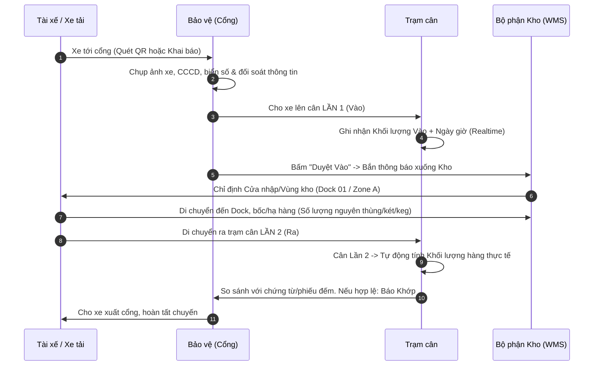

# GIẢI THÍCH PHƯƠNG ÁN QUẢN LÝ XE VÀO/RA & TRẠM CÂN KHO HÀNG (GATE & WEIGHBRIDGE MANAGEMENT)

## 1. TỔNG QUAN PHƯƠNG ÁN

Phương án **Quản lý Cổng vào/ra kết hợp Trạm cân xe tải và Đồng bộ Kho (WMS)** là giải pháp toàn diện giúp tự động hóa quy trình kiểm soát xe giao/nhận hàng. Giải pháp giải quyết 3 mục tiêu cốt lõi:

1. **Chống thất thoát & Kiểm soát khối lượng chính xác:** Sử dụng cơ chế cân 2 lần (Vào/Ra) để xác định khối lượng hàng thực tế giao nhận.
2. **Minh bạch hóa an ninh cổng (Gate Control):** Kiểm soát thông tin tài xế (CCCD, hình ảnh), biển số xe, đơn vị chủ quản và thời gian ra/vào realtime.
3. **Điều phối luồng hàng tự động (Dock & Warehouse Scheduling):** Tự động thông báo và chỉ định khu vực hạ/bốc hàng (Dock/Zone) cho bộ phận kho ngay khi xe qua cổng.

---

## 2. PHƯƠNG THỨC TIẾP NHẬN THÔNG TIN XE TẠI CỔNG

Khi xe đến cổng kho, Bảo vệ thực hiện tiếp nhận thông tin chuyến hàng qua 1 trong 2 cách:

| Tiêu chí | Cách 1: Thu thập / Khai báo tại cổng | Cách 2: Quét mã QR tự động |
| :--- | :--- | :--- |
| **Đối tượng áp dụng** | Xe ngoài, xe giao hàng không thường xuyên, xe nhà cung cấp mới. | Xe quen, xe nhà xe đối tác chiến lược, xe nội bộ đã đăng ký trước. |
| **Thao tác Bảo vệ** | - Nhập tay thông tin chuyến hàng trên màn hình Gate. - Chụp ảnh biển số xe (đầu/đuôi xe). - Chụp ảnh CCCD tài xế và giấy tờ giao hàng. | Dùng thiết bị cầm tay (POS/Handheld Scanner) quét mã QR dán trên kính/thành xe hoặc mã trên smartphone tài xế. |
| **Dữ liệu thu thập** | Đơn vị chủ quản, Tên & CCCD tài xế, Biển số xe, Loại hàng, Trọng lượng đăng ký trên chứng từ. | Tự động load toàn bộ hồ sơ chuyến hàng đã duyệt trước (Tài xế, Biển số, Đơn vị, Danh mục hàng). |
| **Ưu điểm** | Đảm bảo tính linh hoạt, tiếp nhận được tất cả các xe chưa từng đăng ký. | Tốc độ check-in cực nhanh (< 5 giây), giảm ùn tắc tại cổng. |

---

## 3. QUY TRÌNH VẬN HÀNH CHI TIẾT (6 BƯỚC)

### Chi tiết từng bước:

#### Bước 1: Quét / Nhập thông tin tại Cổng
- Bảo vệ kiểm tra thông tin xe qua Cách 1 (chụp ảnh, nhập thông tin) hoặc Cách 2 (quét QR).
- Hệ thống lưu vết thông tin an ninh: Ảnh CCCD tài xế, ảnh biển số xe, thời gian cập bến.

#### Bước 2: Cân Lần 1 (Cân xe lúc VÀO)
- Xe di chuyển lên sàn cân tại Cổng Vào.
- Trạm cân tích hợp tự động ghi nhận:
  - **Trọng lượng VÀO ($W_1$)**
  - **Thời gian VÀO (Realtime Timestamp)**
  - Biển số xe & Tên tài xế
- Bảo vệ bấm nút **"Đồng ý cho VÀO"** trên giao diện điều khiển.

#### Bước 3: Điều phối Dock & Thông báo lên Kho
- Ngay khi Bảo vệ duyệt xe vào:
  - **Hệ thống WMS phát thông báo Realtime** tới màn hình điều độ kho: *"Xe [Biển số] của [Đơn vị A] chở [Loại hàng X] đã qua cổng"*.
  - **Chỉ định vị trí (Dock Allocation):** Màn hình chỉ dẫn tài xế di chuyển tới Cửa nhập hàng (ví dụ: Dock 02) hoặc Vùng lưu trữ (Zone B).
  - **Cập nhật trạng thái Kho:** Đánh dấu vị trí Dock/Zone tương ứng ở trạng thái `BUSY / NHẬP HÀNG`.

#### Bước 4: Bốc / Hạ hàng tại Kho
- Thủ kho và công nhân bốc xếp tiến hành hạ/xuất hàng.
- *Lưu ý quy tắc kho:* Quản lý theo đơn vị **nguyên thùng / nguyên két / nguyên keg**; không xé lẻ chai/lon/lốc.
- Thủ kho xác nhận số lượng đếm thực tế lên phiếu xuất/nhập kho.

#### Bước 5: Cân Lần 2 (Cân xe lúc RA) & Đối soát tự động
- Xe di chuyển lên sàn cân tại Cổng Ra.
- Trạm cân tự động ghi nhận **Trọng lượng RA ($W_2$)** và **Thời gian RA (Realtime)**.
- **Công thức tính toán khối lượng hàng thực tế:**
  $$\text{Khối lượng hàng} = |W_1 - W_2|$$
  - *Đối với hàng Nhập:* $W_1$ (Xe + Hàng) - $W_2$ (Xe rỗng) = Khối lượng hàng hạ vào kho.
  - *Đối với hàng Xuất:* $W_2$ (Xe + Hàng) - $W_1$ (Xe rỗng) = Khối lượng hàng lấy ra khỏi kho.
- **Quy tắc cảnh báo tự động:**
  - Hệ thống lấy $(\text{Số thùng/két/keg} \times \text{Trọng lượng chuẩn/SKU})$ so sánh với Khối lượng cân thực tế $|W_1 - W_2|$.
  - Nếu chênh lệch **nằm trong dung sai cho phép ($\le \pm X\%$)**: Hệ thống tự động báo **HỢP LỆ (GREEN)**.
  - Nếu chênh lệch **vượt dung sai**: Hệ thống bật cảnh báo **BẤT THƯỜNG (RED)**, khóa barrier ra và yêu cầu kiểm tra lại.

#### Bước 6: Cho xe xuất cổng & Đóng chuyến
- Sau khi cân Lần 2 hợp lệ, Bảo vệ xác nhận **Cho xe RA**.
- Trạng thái chuyến hàng cập nhật thành **HOÀN THÀNH**.
- Giải phóng trạng thái vị trí Dock/Zone tại kho về `AVAILABLE (SẴN SÀNG)`.

---

## 4. TÓM TẮT PHÂN CÔNG VÀ NGUYÊN TẮC HỆ THỐNG

### Phân công trách nhiệm:
1. **Bảo vệ cổng:** Thu thập/quét QR thông tin, kiểm tra tính chính xác của biển số/tài xế, duyệt xe vào/ra.
2. **Trạm cân:** Ghi nhận tự động khối lượng $W_1, W_2$, mốc thời gian realtime, tính toán sai lệch.
3. **Thủ kho:** Nhận thông tin xe đang tới, tiếp nhận xe tại Dock được chỉ định, thực hiện bốc xếp và đếm số lượng quy chuẩn nguyên thùng/két/keg.

### Nguyên tắc quản lý:
- Mọi dữ liệu cân và hình ảnh check-in đều được lưu trữ audit trail (vết kiểm toán), không thể sửa đổi thủ công.
- Thời gian vào/ra được tính realtime để đo lường KPI thời gian quay vòng xe (Turnaround Time - TAT).
