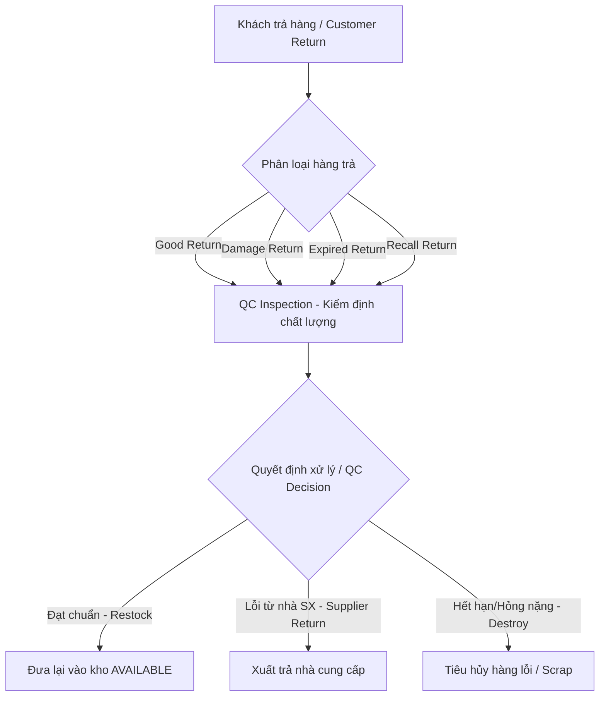

# ĐẶC TẢ YÊU CẦU HỆ THỐNG QUẢN LÝ KHO BIA – NƯỚC NGỌT

## Thông tin tài liệu

| Thuộc tính | Giá trị |
|---|---|
| Phiên bản | 3.1 – Bản tối ưu hóa từ v3 |
| Trạng thái | Draft dùng cho xác nhận và ký duyệt nghiệp vụ |
| Đối tượng đọc | Chủ doanh nghiệp, quản lý kho, mua hàng, bán hàng, kế toán, BA, kiến trúc sư và đội phát triển |
| Mục đích | Chốt phạm vi, quy tắc nghiệp vụ và tiêu chí nghiệm thu trước khi thiết kế chi tiết |
| Nguyên tắc sử dụng | Nội dung đánh dấu “Cần xác nhận” chưa được xem là quyết định nghiệp vụ chính thức |

### Lịch sử thay đổi

| Phiên bản | Thay đổi chính |
|---|---|
| 3.1 Draft | Chuẩn hóa Product–SKU; thiết kế lại On-hand–Reservation–ATP; cấu hình hóa MRSL/location mixing; hoàn thiện Recall, acceptance criteria, UAT và cổng quyết định. |

### Quy ước mức độ ưu tiên

- P0 – Bắt buộc để hệ thống vận hành đúng và có thể đưa vào production.
- P1 – Quan trọng cho vận hành MVP nhưng có thể triển khai sau luồng lõi.
- P2 – Tối ưu hóa hoặc mở rộng sau khi dữ liệu và quy trình đã ổn định.

---

# 1. Bối cảnh nghiệp vụ và Mục tiêu (Business Context & Objectives)

## 1.1. Giới thiệu (Introduction)

### 1.1.1. Mục đích (Purpose)
Tài liệu Đặc tả Yêu cầu Nghiệp vụ (BRD) này được xây dựng nhằm định nghĩa toàn bộ yêu cầu chức năng, phi chức năng, quy tắc nghiệp vụ và mô hình dữ liệu cho Hệ thống Quản lý Kho (WMS) chuyên biệt cho ngành Bia và Nước giải khát. Hệ thống là công cụ cốt lõi giúp chuẩn hóa quy trình vận hành kho từ khâu nhập hàng, quản lý vị trí, cấp phát hàng theo FEFO, kiểm soát vỏ chai/két hoàn trả, cho đến các quy trình kiểm kê và xử lý đổi trả.

### 1.1.2. Phạm vi tài liệu (Scope)
Tài liệu này bao trùm các nghiệp vụ quản lý kho tại các chi nhánh/kho hàng của doanh nghiệp phân phối nước giải khát. Phạm vi kỹ thuật bao gồm mô tả luồng dữ liệu, các ràng buộc nghiệp vụ, cấu trúc dữ liệu khái niệm và các kịch bản nghiệm thu (UAT) cho phiên bản MVP và định hướng mở rộng. Tài liệu này đóng vai trò là cơ sở để đội ngũ phát triển thiết kế cơ sở dữ liệu, xây dựng API và phát triển giao diện người dùng.

### 1.1.3. Thuật ngữ viết tắt (Definitions)
* **WMS**: Warehouse Management System (Hệ thống quản lý kho).
* **FMCG**: Fast-Moving Consumer Goods (Hàng tiêu dùng nhanh).
* **SKU**: Stock Keeping Unit (Đơn vị phân loại hàng tồn kho).
* **FEFO**: First Expired, First Out (Hết hạn trước, xuất trước).
* **FIFO**: First In, First Out (Nhập trước, xuất trước).
* **UOM**: Unit of Measure (Đơn vị tính).
* **PO**: Purchase Order (Đơn mua hàng).
* **QC**: Quality Control (Kiểm soát chất lượng).
* **MRSL**: Minimum Remaining Shelf Life (Hạn sử dụng còn lại tối thiểu).
* **ROP**: Reorder Point (Điểm đặt hàng lại).

### 1.1.4. Mục tiêu kinh doanh (Business Objectives)
* **Tối ưu hóa vòng đời hàng hóa**: Kiểm soát nghiêm ngặt hạn sử dụng của bia và nước ngọt, giảm tỷ lệ hàng hết hạn/hủy xuống mức dưới 0.5%.
* **Nâng cao hiệu quả vận hành**: Giảm thời gian soạn hàng (picking) xuống dưới 10 phút/đơn, tự động hóa quy trình đề xuất đặt hàng và xoay vòng vỏ chai/két cọc.
* **Đảm bảo tính chính xác**: Đạt độ chính xác tồn kho thực tế và hệ thống trên 99%.
* **Kiểm soát thất thoát**: Loại bỏ hoàn toàn tình trạng xuất sai lô, thất thoát vỏ két cọc và chênh lệch kiểm kê không rõ nguyên nhân.

### 1.1.5. Các bên liên quan (Stakeholders)
* **Ban Giám đốc (Sponsors)**: Phê duyệt ngân sách, định hướng chiến lược kinh doanh và kỳ vọng báo cáo tổng quan.
* **Bộ phận Mua hàng (Purchasing Team)**: Sử dụng hệ thống để theo dõi hiệu suất nhà cung cấp và nhận đề xuất mua hàng.
* **Bộ phận Vận hành Kho (Warehouse Operations)**: Thực hiện nhập, xuất, chuyển vị trí, kiểm kê và quản lý vỏ cọc.
* **Bộ phận Kế toán (Accounting Team)**: Đối soát giá trị tồn kho, công nợ tiền cọc vỏ chai/két và đồng bộ dữ liệu tài chính.
* **Đội ngũ Phát triển Hệ thống (BA, Dev, QA)**: Sử dụng tài liệu để hiện thực hóa phần mềm.

## 1.2. Tầm nhìn (Vision)
Xây dựng hệ thống quản lý kho chuyên sâu dành cho doanh nghiệp phân phối bia và nước giải khát, tối ưu hóa toàn bộ vòng đời hàng hóa, giảm thiểu thất thoát vỏ cọc và hàng cận hạn, đồng thời nâng cao hiệu quả vận hành kho thông qua tự động hóa các chỉ số FMCG và quy trình kiểm soát chất lượng nghiêm ngặt.

## 1.3. Tiêu chí thành công (Success Criteria)

Hệ thống được đánh giá là đáp ứng mục tiêu khi đạt các chỉ số KPI vận hành cụ thể sau:

| Chỉ số (Metric) | Tiêu chí đo lường (Success Criteria) | Ghi chú |
|---|---|---|
| **Inventory Accuracy** | **99%** | Độ chính xác giữa tồn kho thực tế và số liệu trên hệ thống. |
| **Search Time** | **<2 phút** | Thời gian tìm kiếm thông tin hàng hóa/vị trí trên hệ thống (< 2 giây) và thời gian định vị hàng thực tế trong kho (< 2 phút). |
| **Near Expiry Detection** | **100%** | Phát hiện và cảnh báo tự động mọi lô hàng sắp hết hạn sử dụng. |
| **Stock Update** | **Realtime** | Số dư tồn kho khả dụng được cập nhật ngay lập tức sau khi chứng từ được ghi sổ (Posted). |
| **No Negative Inventory**| **100%** | Hoàn toàn không xảy ra tình trạng tồn kho âm (vật lý hoặc khả dụng). |

Bên cạnh đó, hệ thống cần đảm bảo các tiêu chí nền tảng:
- Mọi thay đổi số dư đều truy được về một chứng từ đã ghi sổ.
- Tổng bút toán tăng/giảm/chuyển trạng thái khớp với số dư tồn tại mọi thời điểm.
- Không phát sinh tồn khả dụng âm trong các giao dịch thông thường.
- Có thể trả lời trong một màn hình: hàng gì, bao nhiêu, thuộc lô nào, ở đâu, trạng thái gì và đã giữ cho đơn nào.
- Có thể truy từ lô nhập đến các khách hàng đã nhận lô đó.
- Chênh lệch kiểm kê và hàng hủy không thể làm thay đổi tồn khi chưa được phê duyệt.
- Các báo cáo nhập–xuất–tồn đối chiếu được với sổ giao dịch kho.

---

# 2. Phạm vi

## 2.1. Phạm vi MVP đề xuất

1. Người dùng, vai trò, quyền và phạm vi kho.
2. Danh mục sản phẩm/SKU, thương hiệu, đơn vị tính, quy đổi đóng gói và barcode.
3. Kho, khu vực, vị trí và trạng thái vị trí.
4. Nhà cung cấp, yêu cầu mua và đơn mua cơ bản.
5. Nhập kho theo lô, hạn sử dụng và nhận hàng một phần.
6. Quản lý số dư vật lý, tồn khả dụng, tồn giữ, tồn cách ly và tồn lỗi.
7. Yêu cầu xuất, cấp phát lô theo FEFO, picking và ghi sổ xuất.
8. Chuyển vị trí và chuyển kho.
9. Kiểm kê, đếm lại và điều chỉnh có phê duyệt.
10. Hàng lỗi, khách trả, trả nhà cung cấp và hủy hàng.
11. Cảnh báo tồn tối thiểu, tồn tối đa, cận hạn và hết hạn.
12. Báo cáo nhập–xuất–tồn, lô/HSD, chênh lệch và audit.
13. Quản lý vỏ/két/keg và tiền cọc nếu doanh nghiệp có luân chuyển bao bì hoàn trả.

## 2.2. Ngoài phạm vi MVP

Các mục sau chỉ triển khai khi có quyết định riêng:

- Kế toán tổng hợp, hóa đơn điện tử và sổ công nợ đầy đủ.
- AI dự báo nhu cầu.
- Tối ưu vị trí kho bằng thuật toán nâng cao.
- Voice picking hoặc robot kho.
- Thương mại điện tử đa kênh.
- BI/data warehouse riêng.
- Quản lý vận tải và tối ưu tuyến giao hàng.

Nếu doanh nghiệp đã có POS, ERP hoặc phần mềm kế toán, hệ thống kho chỉ lưu tham chiếu và trạng thái đồng bộ; không tạo thêm một sổ tài chính độc lập nếu chưa chốt trách nhiệm hệ thống.

## 2.3. Giả định thiết kế tạm thời – cần xác nhận

| ID | Giả định đề xuất | Trạng thái |
|---|---|---|
| A-01 | Một Product có một hoặc nhiều SKU; mỗi SKU thuộc đúng một Product và đại diện một biến thể/quy cách quản lý tồn cụ thể. | Đề xuất v3.1 – cần xác nhận |
| A-02 | SKU được quản lý theo lô phải có chính sách ngày bắt buộc; MFG/EXP có thể bắt buộc theo nhóm SKU và quy định pháp lý, không hard-code cho mọi loại hàng. | Đề xuất v3.1 – cần xác nhận |
| A-03 | Chỉ thao tác POSTED mới tạo Inventory Movement và thay đổi Inventory Balance; Confirm/Approve chỉ thay đổi trạng thái quy trình. | Đề xuất v3.1 – cần xác nhận |
| A-04 | Hệ thống hỗ trợ nhiều kho ngay từ mô hình dữ liệu; MVP có thể chỉ vận hành một kho. | Cần xác nhận |
| A-05 | Mỗi SKU có đúng một đơn vị tồn cơ sở; số dư lưu bằng số nguyên đơn vị cơ sở. | Cần xác nhận |
| A-06 | FEFO là quy tắc cấp phát mặc định bắt buộc; ngoại lệ cần quyền và lý do. | Cần xác nhận |
| A-07 | Không cho tồn vật lý hoặc tồn khả dụng âm dưới mọi hình thức. | Cần xác nhận |
| A-08 | Hàng khách trả được đưa vào cách ly trước khi được phép bán lại. | Cần xác nhận |
| A-09 | Giá vốn MVP dùng bình quân di động; có thể thay đổi sau khi kế toán xác nhận. | Cần xác nhận |

---

# 3. Thuật ngữ

| Thuật ngữ | Định nghĩa |
|---|---|
| Sản phẩm | Khái niệm thương mại chung, ví dụ Bia A |
| SKU | Một biến thể quản lý tồn cụ thể theo thương hiệu, dung tích, bao bì và quy cách |
| Đơn vị cơ sở | Đơn vị nhỏ nhất hệ thống dùng để lưu số dư, ví dụ chai hoặc lon |
| Đơn vị giao dịch | Thùng, két, lốc, chai, lon hoặc keg dùng khi nhập/xuất |
| Quy đổi đóng gói | Hệ số chuyển đơn vị giao dịch về đơn vị cơ sở |
| Lô/Batch | Nhóm hàng có cùng mã lô và thuộc tính sản xuất/hạn sử dụng |
| Tồn vật lý | Hàng thực tế thuộc quyền quản lý của kho, gồm cả hàng cách ly hoặc lỗi |
| Tồn khả dụng | Phần tồn đủ điều kiện cấp phát cho đơn bán/xuất |
| Reservation | Lượng hàng được giữ cho một yêu cầu xuất hoặc đơn bán |
| On-hand | Số lượng đã POSTED đang nằm tại một kho/vị trí theo trạng thái chất lượng |
| Sellable On-hand | Tổng On-hand ở trạng thái AVAILABLE, chưa trừ reservation |
| ATP | Available to Promise: lượng có thể cam kết cho nhu cầu mới sau khi trừ reservation còn hiệu lực |
| FEFO | Lô hết hạn trước được ưu tiên xuất trước |
| FIFO | Lô nhập trước được ưu tiên xuất trước |
| Cách ly | Hàng chưa được bán vì đang chờ kiểm tra hoặc quyết định xử lý |
| Ghi sổ/Posted | Thao tác cuối tạo bút toán kho và thay đổi số dư |
| Ledger | Sổ giao dịch bất biến ghi tất cả biến động tăng, giảm, chuyển vị trí và chuyển trạng thái |
| Bao bì hoàn trả | Vỏ chai, két, pallet hoặc keg phải thu hồi hoặc có tiền cọc |
| Tiền cọc bao bì | Khoản phải thu/phải trả phát sinh khi giao hoặc nhận bao bì hoàn trả |
| In-transit | Hàng đã rời kho nguồn nhưng chưa được kho đích xác nhận nhận |

---

# 4. Actor và phân quyền

## 4.1. Actor

### Quản trị hệ thống

- Quản lý tài khoản, vai trò, quyền và cấu hình kỹ thuật.
- Không mặc nhiên có quyền tạo hoặc phê duyệt giao dịch kinh doanh.

### Nhân viên kho

- Nhận hàng, put-away, picking, xuất hàng, chuyển vị trí, kiểm kê.
- Ghi nhận hàng lỗi, hết hạn và bao bì hoàn trả.

### Nhân viên mua hàng

- Quản lý nhà cung cấp, yêu cầu mua, đơn mua và theo dõi giao hàng.

### Nhân viên bán hàng

- Xem tồn khả dụng, tạo yêu cầu xuất, theo dõi reservation và hàng trả.

### Kế toán

- Xem/đối chiếu giá nhập, giá trị tồn, tiền cọc và dữ liệu tích hợp kế toán.
- Không trực tiếp sửa số dư tồn.

### Quản lý

- Phê duyệt mua hàng, ngoại lệ nhận/xuất, điều chỉnh, hủy hàng và override FEFO.
- Xem dashboard, báo cáo và audit theo phạm vi được cấp.

## 4.2. Ma trận quyền khởi điểm

Ký hiệu: V = xem, C = tạo/sửa nháp, E = thực hiện/ghi sổ, A = phê duyệt, M = quản trị.

| Chức năng | Admin | Kho | Mua hàng | Bán hàng | Kế toán | Quản lý |
|---|---:|---:|---:|---:|---:|---:|
| Danh mục SKU/UOM/barcode | M/V | V | C/V | V | V | A/V |
| Xem tồn vật lý | V | V | V | Theo phạm vi | V | V |
| Xem tồn khả dụng | V | V | V | V | V | V |
| Giá nhập/giá vốn | Theo quyền | Không | C/V | Không | C/V | V |
| Yêu cầu/đơn mua | V | V | C | Không | V | A |
| Nhập kho | V | C/E | V | Không | V | A ngoại lệ |
| Yêu cầu xuất | V | V | Không | C | V | A ngoại lệ |
| Picking/xác nhận xuất | V | C/E | Không | V | V | A ngoại lệ |
| Chuyển kho/vị trí | V | C/E | Không | Không | V | A |
| Kiểm kê | V | C/E | Không | Không | V | A |
| Điều chỉnh/hủy | V | C/E | Không | Không | V | A |
| Tiền cọc/công nợ vỏ | Theo quyền | C số lượng | V | C/V | C/V | A/V |
| Người dùng/vai trò | M | Không | Không | Không | Không | A/V |
| Audit log | V | Theo phạm vi | Theo phạm vi | Theo phạm vi | V tài chính | V |

## 4.3. Nguyên tắc phân tách trách nhiệm

- Người tạo không được tự phê duyệt chứng từ do mình tạo.
- Người thực hiện kiểm kê không được tự phê duyệt chênh lệch của chính đợt kiểm kê đó.
- Admin kỹ thuật không mặc nhiên có quyền nghiệp vụ.
- Quyền được giới hạn theo kho/chi nhánh, loại chứng từ và ngưỡng giá trị.
- Quyền khẩn cấp phải có thời hạn, lý do, người phê duyệt và audit.

---

# 5. Mô hình tồn kho và quy tắc nền tảng

## 5.1. Khóa số dư

Một số dư tồn được xác định tối thiểu bởi:

SKU + lô + kho + vị trí + trạng thái tồn.

Một lô có thể đồng thời nằm ở nhiều vị trí và nhiều trạng thái. Không lưu một trường vị trí duy nhất hoặc một số lượng còn lại duy nhất trực tiếp trên lô để đại diện toàn bộ tồn của lô.

## 5.2. Trạng thái tồn và Reservation

Hệ thống sử dụng hai lớp dữ liệu độc lập để tránh trừ reservation hai lần:

1. **Inventory Balance/On-hand** lưu số lượng đã POSTED theo các trạng thái vật lý loại trừ lẫn nhau:
   - `AVAILABLE`: hàng đạt điều kiện bán/cấp phát.
   - `QUARANTINED`: hàng cách ly/chờ QC.
   - `DAMAGED`: hàng hư hỏng chờ xử lý.
   - `EXPIRED`: hàng đã hết hạn.
   - `BLOCKED`: hàng bị khóa nghiệp vụ hoặc kiểm kê.
   - `RECALLED`: hàng thuộc chiến dịch thu hồi đang hiệu lực.
2. **Inventory Reservation** là bản ghi giữ chỗ riêng tham chiếu nhu cầu xuất và một phạm vi tồn khả dụng. `RESERVED` không phải `StockStatus` và không được cộng như một thành phần vật lý riêng.
3. Chuyển chất lượng là movement giữa các trạng thái On-hand, ví dụ `AVAILABLE → QUARANTINED`; movement không tự tạo hoặc xóa reservation nếu chưa thực hiện quy tắc giải phóng/tái phân bổ tương ứng.
4. `IN_TRANSIT` là số lượng doanh nghiệp vẫn sở hữu nhưng đang nằm ngoài On-hand của kho nguồn và kho đích. Hệ thống phải báo cáo riêng Warehouse On-hand và Enterprise-owned Inventory.

Các khái niệm chuẩn:

$$\text{Warehouse On-hand} = \sum(\text{AVAILABLE, QUARANTINED, DAMAGED, EXPIRED, BLOCKED, RECALLED})$$

$$\text{Sellable On-hand} = \sum(\text{AVAILABLE})$$

$$\text{Active Reservation} = \sum(\text{reservation còn hiệu lực và chưa fulfillment})$$

$$\text{ATP} = \text{Sellable On-hand} - \text{Active Reservation}$$

$$\text{Enterprise-owned Inventory} = \sum(\text{Warehouse On-hand}) + \sum(\text{IN_TRANSIT})$$

Ví dụ: Sellable On-hand là 100 lon và Active Reservation là 30 lon thì ATP cho nhu cầu mới là 70 lon. Inventory Balance vẫn lưu 100 lon `AVAILABLE`; reservation 30 lon được lưu riêng và chỉ giảm khi Goods Issue được POSTED.

## 5.3. Quy tắc tính và bất biến số dư

1. `InventoryBalance.quantity_on_hand` không được âm ở bất kỳ khóa số dư nào.
2. ATP không được âm khi tạo reservation mới; backorder/pre-order nếu được phép phải lưu dưới dạng nhu cầu thiếu, không ghi số dư âm.
3. Tổng Active Reservation không được vượt Sellable On-hand trong cùng phạm vi cấp phát sau khi transaction hoàn tất.
4. Hàng trên PO chưa nhận là `Expected Inbound`, không thuộc On-hand, ATP hoặc Enterprise-owned Inventory.
5. Movement giữa các trạng thái On-hand phải cân bằng nguồn–đích trong cùng transaction.
6. Mọi phép tính ATP dùng cùng một dịch vụ/quy tắc chuẩn và kiểm soát concurrency; màn hình và báo cáo không tự triển khai công thức riêng.

## 5.4. Đơn vị tính và quy cách đóng gói (UOM)

- Mỗi SKU đại diện cho một quy cách đóng gói nguyên kiện vật lý (Thùng/Két/Keg) cụ thể khi nhập xuất.
- Số lượng tồn kho và mọi giao dịch được ghi nhận dưới dạng Số nguyên theo đơn vị lưu kho cơ sở này (ví dụ: 10 Thùng Tiger, 5 Két Heineken). Không xé lẻ thùng vật lý trong kho.
- Phục vụ khai báo thuế và hóa đơn, hệ thống hỗ trợ tính toán quy đổi động (on-the-fly) ra số Lon/Chai hoặc số Lít bia dựa trên thông số tĩnh của SKU (`packaging_specification` - số lon/chai mỗi thùng, và `volume_ml` - thể tích mỗi lon/chai).
- Mỗi SKU có một Barcode riêng duy nhất liên kết 1-1 với quy cách đóng gói đó.

## 5.5. Nguyên tắc ledger

- Không cho phép CRUD trực tiếp lên số dư.
- Chỉ thao tác ghi sổ tạo Inventory Movement.
- Mỗi lần ghi sổ phải nguyên tử: toàn bộ chứng từ thành công hoặc toàn bộ thất bại.
- Mỗi movement có nguồn, đích, SKU, lô, số lượng cơ sở, chứng từ, thời gian và actor.
- Chứng từ đã ghi sổ không được sửa hoặc xóa.
- Giao dịch đảo tham chiếu chính xác giao dịch gốc.
- Sử dụng idempotency key để ngăn gửi lặp và version để ngăn ghi đè đồng thời.

## 5.6. Quản lý Date và Hạn sử dụng (Date Management)

Do tính chất đặc thù của ngành FMCG (Đồ uống có cồn và nước giải khát), việc quản lý ngày tháng và vòng đời sản phẩm là tối quan trọng:

1. **Các mốc thời gian bắt buộc ghi nhận**:
   - **Ngày sản xuất (Manufacturing Date - MFG)**: Do nhà sản xuất in trên bao bì.
   - **Hạn sử dụng (Expiration Date - EXP)**: Ngày hết hạn sử dụng của lô sản phẩm.
   - **Ngày nhận hàng (Receiving Date)**: Ngày thực nhận hàng hóa vào kho của doanh nghiệp.
2. **Các chỉ số phân tích vòng đời**:
   - **Tuổi hàng tồn kho (Inventory Aging)**: Số ngày hàng thực tế nằm trong kho tính từ ngày nhận.
     $$\text{Inventory Aging} = \text{Ngày hiện tại} - \text{Receiving Date}$$
   - **Hạn sử dụng còn lại (Shelf Life Remaining)**:
     - Tính bằng Số ngày thực tế: $\text{EXP} - \text{Ngày hiện tại}$ (được dùng làm thước đo duy nhất để kiểm duyệt HSD).
3. **Quy tắc Hạn sử dụng còn lại tối thiểu (Minimum Remaining Shelf Life - MRSL)**:
   - MRSL là chính sách cấu hình có thời gian hiệu lực; hỗ trợ ngưỡng theo số ngày (`min_remaining_days`).
   - Chính sách có thể áp dụng theo nghiệp vụ `INBOUND/OUTBOUND`, SKU/nhóm SKU, nhà cung cấp, khách hàng/kênh bán và kho. Khi nhiều chính sách cùng khớp, hệ thống dùng quy tắc cụ thể nhất; trường hợp đồng mức phải báo xung đột cấu hình.
   - Mỗi chính sách quy định hành động khi vi phạm: `REJECT`, `QUARANTINE` hoặc `ALLOW_WITH_APPROVAL`. Mọi ngoại lệ phải có actor, quyền, lý do và audit.
   - Mức 30% chỉ là giá trị tham khảo cho workshop, không phải hard constraint cho đến khi D-012 được duyệt.
   - Hàng đã hiện diện vật lý nhưng không đạt MRSL vẫn phải được ghi nhận bằng receipt/exception record và đưa vào khu từ chối hoặc `QUARANTINED`; không được để hàng thực tế ngoài hệ thống chỉ vì phiếu nhập bị chặn.

## 5.7. Các công thức và chỉ số quản lý tồn kho FMCG (FMCG Inventory Formulas)

Hệ thống cung cấp các công thức chuẩn để hỗ trợ việc tối ưu hóa lượng tồn kho, giảm thất thoát và lập kế hoạch mua hàng tự động:

1. **Thời gian giao hàng (Lead Time)**:
   - **Lead Time chuẩn**: Thời hạn giao hàng cam kết theo hợp đồng của nhà cung cấp.
   - **Lead Time thực tế**: Thời gian từ thời điểm PO được gửi/chấp nhận đến lần nhận hàng theo mốc được cấu hình. Hệ thống phải tách `First Receipt Lead Time` và `Complete Receipt Lead Time` đối với PO nhận nhiều lần.
     $$\text{First Receipt Lead Time} = \text{First Accepted Receipt} - \text{PO Sent At}$$
     $$\text{Complete Receipt Lead Time} = \text{Completed Receipt At} - \text{PO Sent At}$$
     *Ví dụ*: Gửi PO ngày 01/08, hàng về kho ngày 05/08 -> Lead Time thực tế là 4 ngày.
2. **Lead Time Demand (Nhu cầu trong thời gian gom hàng)**:
   $$\text{Lead Time Demand} = \text{Doanh số bán trung bình ngày (Average Daily Sales)} \times \text{Lead Time}$$
3. **Safety Stock (Tồn kho an toàn)**:
   Thiết lập lượng tồn kho đệm để tránh đứt gãy nguồn cung do biến động thị trường hoặc nhà cung cấp giao trễ:
   $$\text{Safety Stock} = (\text{Doanh số ngày Max} \times \text{Lead Time Max}) - (\text{Doanh số ngày TB} \times \text{Lead Time TB})$$
4. **Reorder Point (Điểm đặt hàng lại - ROP)**:
   Ngưỡng tồn khả dụng tối thiểu để kích hoạt đề xuất mua hàng mới:
   $$\text{ROP} = \text{Lead Time Demand} + \text{Safety Stock}$$
5. **Purchase Suggestion (Đề xuất đặt hàng)**:
   Khi Tồn khả dụng hiện tại rơi xuống dưới ROP (Current Stock < ROP), hệ thống tự động đưa ra đề xuất mua:
   - *Ví dụ*:
     - Tồn khả dụng hiện tại (Current Stock): 50 thùng
     - Điểm đặt lại (ROP): 80 thùng
     - Vì $50 < 80$, hệ thống tự động cảnh báo và tạo đề xuất mua theo mức tồn mục tiêu đã cấu hình. Không sử dụng con số minh họa làm quy tắc mặc định.

---

# 6. Yêu cầu chức năng

## FR-01. Danh mục sản phẩm, SKU và đóng gói – P0

Hệ thống phải:

1. Quản lý mã SKU duy nhất, tên, nhóm hàng, thương hiệu, nhà sản xuất, quốc gia, dung tích, gas/không gas, loại bao bì và trạng thái kinh doanh.
2. Tách các chiều phân loại: nhóm đồ uống, thương hiệu, dung tích, bao bì và kênh bán; không gộp chúng vào một cây danh mục duy nhất.
3. Quản lý đơn vị cơ sở và nhiều đơn vị giao dịch cho mỗi SKU.
4. Quản lý hệ số quy đổi, barcode, kích thước, thể tích và khối lượng theo cấp đóng gói.
5. Chặn trùng mã SKU và barcode còn hiệu lực.
6. Không cho xóa SKU đã phát sinh giao dịch; chỉ cho khóa/ngừng kinh doanh.
7. Lưu lịch sử thay đổi quy cách, barcode và trạng thái.

Tiêu chí nghiệm thu:

- Khi nhập 2 thùng của SKU có quy đổi 24 lon/thùng, hệ thống ghi nhận 48 lon cơ sở.
- Khi cấu hình “không cho phá thùng”, yêu cầu xuất 6 lon bị chặn và trả thông báo rõ nguyên nhân.
- Đổi quy cách từ thời điểm mới không làm thay đổi số lượng quy đổi trên phiếu cũ.

## FR-02. Kho, khu vực và vị trí – P0

Hệ thống phải:

1. Quản lý kho, zone, dãy, kệ, tầng và ô chứa.
2. Quản lý trạng thái vị trí: hoạt động, khóa, kiểm kê, bảo trì.
3. Quản lý giới hạn sức chứa độc lập theo thể tích, khối lượng và số pallet slot nếu áp dụng.
4. Cấu hình loại hàng được phép chứa và khu vực cách ly/hàng lỗi.
5. Tìm vị trí theo mã, barcode/QR và hiển thị các SKU/lô đang chứa.
6. Cảnh báo hoặc chặn put-away vượt giới hạn theo cấu hình.
7. Không cho trộn hàng AVAILABLE với hàng lỗi/cách ly trong cùng vị trí nếu chính sách kho không cho phép.

Tiêu chí nghiệm thu:

- Khi vị trí đã khóa, hệ thống không cho ghi sổ nhập/chuyển hàng vào vị trí đó.
- Khi khối lượng sau put-away vượt tải trọng, hệ thống chặn hoặc yêu cầu override có thẩm quyền.

## FR-03. Nhà cung cấp và mua hàng – P0

Hệ thống phải:

1. Quản lý nhà cung cấp, mã số, liên hệ, lead time, điều khoản và trạng thái.
2. Tạo yêu cầu mua (Purchase Request - PR) gồm nhiều dòng SKU.
3. Gửi duyệt, phê duyệt/từ chối với lý do.
4. Chuyển yêu cầu đã duyệt thành đơn mua (Purchase Order - PO).
5. Quản lý PO theo trạng thái và từng dòng: số lượng đặt, đã nhận, còn lại, giá, ngày giao hàng dự kiến.
6. **Ứng dụng Lead Time vào chứng từ mua hàng**: PR chỉ hiển thị ngày ước tính khi đã xác định nguồn cung; PO tính **Expected Delivery Date** từ thời điểm gửi/chấp nhận và business calendar:
   $$\text{Expected Delivery Date} = \text{PO Sent/Accepted At} + \text{Lead Time chuẩn của Nhà cung cấp}$$
7. **Theo dõi giao trễ thực tế**: Tự động đo lường hiệu suất giao hàng bằng cách tính số ngày trễ khi nhập kho:
   $$\text{Số ngày trễ} = \text{Ngày thực tế nhận (Goods Receipt Date)} - \text{Expected Delivery Date}$$
8. Hỗ trợ nhận một phần, giao dư/thiếu theo dung sai, backorder, đóng hoặc hủy phần còn lại.
9. Chặn ghi nhận vượt dung sai nếu không có phê duyệt ngoại lệ.
10. Theo dõi chênh lệch giá/thực nhận.

Tiêu chí nghiệm thu:

- PO 100 thùng nhận lần đầu 60, lần sau 40 phải hiển thị đúng Partially Received rồi Received.
- Khi gửi/chấp nhận PO ngày 01/08 với Lead Time = 4 ngày theo calendar đã cấu hình, hệ thống phải tính đúng ngày giao dự kiến tương ứng.
- Nếu dung sai nhận dư là 2%, nhận 105 thùng phải bị chặn hoặc chuyển duyệt ngoại lệ.

## FR-04. Nhập kho – P0

Hệ thống phải:

1. Tạo phiếu nhập nhiều dòng từ PO hoặc nhập ngoại lệ có quyền.
2. Ghi nhận SKU, đơn vị giao dịch, số lượng, lô, NSX, HSD, giá thực tế, vị trí và tình trạng.
3. Đối chiếu đặt–nhận và ghi nhận thiếu, dư, sai SKU, hư hỏng.
4. Kiểm tra HSD lớn hơn NSX và hạn còn lại tối thiểu theo chính sách.
5. Cho phép nhập một dòng PO thành nhiều lô hoặc nhiều vị trí.
6. Đưa hàng vào AVAILABLE hoặc QUARANTINED tùy chính sách kiểm tra chất lượng.
7. Yêu cầu xác nhận trước khi POSTED.
8. Sau POSTED, tạo movement, cập nhật PO và lưu bằng chứng.
9. Chống ghi nhận trùng bằng số chứng từ ngoài/idempotency key.

Tiêu chí nghiệm thu:

- Phiếu nháp không làm tăng tồn.
- Khi POSTED thành công, tồn, ledger và lượng đã nhận trên PO cùng cập nhật trong một giao dịch.
- Nếu một dòng lỗi, toàn bộ lần POSTED thất bại và không để lại số dư dở dang.

## FR-05. Quản lý lô, hạn sử dụng và truy xuất – P0

Hệ thống phải:

1. Quản lý số lô, SKU, NSX, HSD, nguồn nhập và trạng thái chất lượng.
2. Cấu hình phạm vi duy nhất của số lô theo SKU/nhà sản xuất.
3. Chặn bán lô EXPIRED, QUARANTINED, BLOCKED hoặc RECALLED.
4. Cảnh báo lô sắp hết hạn theo ngưỡng từng nhóm hàng.
5. Hỗ trợ khóa/thu hồi lô và ngăn cấp phát mới ngay lập tức.
6. Truy từ nhà cung cấp và lần nhập đến lô, movement và khách/đơn nhận hàng.
7. Quản lý ngoại lệ hàng không có hoặc không đọc được mã lô theo quyền.

Tiêu chí nghiệm thu:

- Khi một lô bị chuyển sang RECALLED, tồn đó không còn trong tồn khả dụng.
- Báo cáo truy xuất hiển thị được các lần nhập và lần xuất liên quan đến lô.

## FR-06. Tồn kho, reservation và tìm kiếm – P0

Hệ thống phải:

1. Hiển thị tồn theo SKU, lô, kho, vị trí, trạng thái và đơn vị quy đổi.
2. Hiển thị riêng Warehouse On-hand, Sellable On-hand, Active Reservation, ATP, cách ly, lỗi, hết hạn, in-transit, Enterprise-owned Inventory và inbound dự kiến.
3. Tạo reservation cho yêu cầu xuất/đơn bán đủ điều kiện.
4. Hỗ trợ thời hạn reservation và tự giải phóng khi hết hạn hoặc hủy đơn.
5. Ngăn hai người cùng giữ/xuất vượt số lượng khả dụng.
6. Tìm kiếm bằng SKU, tên, thương hiệu, barcode, lô hoặc vị trí.
7. ATP là chỉ số chuẩn cho mọi luồng cam kết/cấp phát, không phải trường tùy chọn hoặc công thức riêng của màn hình.

Tiêu chí nghiệm thu:

- Với Sellable On-hand 100 lon và Active Reservation 30 lon, ATP cho nhu cầu mới là 70 lon; Inventory Balance vẫn là 100 lon AVAILABLE.
- Hai yêu cầu đồng thời mỗi yêu cầu 60 lon không thể cùng được giữ nếu chỉ có 100 lon.
- Tạo/giải phóng reservation không tạo Inventory Movement; POSTED Goods Issue mới làm giảm On-hand.

## FR-07. Xuất kho và FEFO – P0

Hệ thống phải:

1. Tạo yêu cầu xuất nhiều dòng và liên kết đơn bán/đối tượng nhận.
2. Kiểm tra tồn khả dụng trước khi duyệt và trước khi POSTED.
3. Cấp phát lô theo FEFO; nếu cùng HSD thì ưu tiên ngày nhập trước.
4. Áp dụng hạn còn lại tối thiểu theo khách hàng/kênh nếu được cấu hình.
5. Hỗ trợ picking theo vị trí, xác nhận số lượng thực tế và quét barcode.
6. Ghi người yêu cầu, người duyệt, người picking và người xác nhận.
7. Chỉ POSTED khi các dòng hợp lệ; sau đó giảm tồn và đóng reservation.
8. Cho phép xuất một phần/backorder nếu chính sách cho phép.
9. Override FEFO phải có quyền, chọn lý do và tạo audit cảnh báo.
10. Hàng tặng phải có dòng xuất, lô và số lượng dù giá bán bằng 0.

Tiêu chí nghiệm thu:

- Hệ thống đề xuất lô có HSD gần nhất nhưng chưa hết hạn và đủ điều kiện.
- Người không có quyền không thể thay lô FEFO.
- Phiếu xuất nháp/đang picking chưa làm giảm tồn vật lý; reservation vẫn ngăn đơn khác dùng hàng.

## FR-08. Chuyển vị trí và chuyển kho – P0 nếu có nhiều kho

Hệ thống phải:

1. Chuyển vị trí trong cùng kho bằng movement nguồn–đích.
2. Chuyển kho theo quy trình hai bước: xuất kho nguồn → IN_TRANSIT → nhận kho đích.
3. Hỗ trợ nhận một phần, thiếu/hỏng trong vận chuyển và xử lý chênh lệch.
4. Hàng IN_TRANSIT không thuộc tồn khả dụng của kho nguồn hoặc kho đích.
5. Không cho hủy chuyển kho sau khi đã xuất nguồn; phải nhận/điều tra hoặc đảo theo quy trình.

Tiêu chí nghiệm thu:

- Sau khi xuất nguồn, số lượng giảm tại nguồn và tăng IN_TRANSIT.
- Chỉ sau khi kho đích nhận, số lượng mới tăng tại vị trí đích.

## FR-09. Bao bì hoàn trả và tiền cọc – P0 nếu có nghiệp vụ

Hệ thống phải:

1. Quản lý loại bao bì: vỏ chai, két, pallet, keg; phân biệt đầy/rỗng/hỏng/mất.
2. Ghi movement bao bì theo kho, khách hàng, nhà cung cấp và trạng thái vận chuyển.
3. Theo dõi số lượng bao bì đang nằm tại từng đối tác.
4. Ghi phát sinh tiền cọc/phải thu/phải trả khi giao hoặc nhận bao bì.
5. Hoàn/đối trừ tiền cọc khi nhận lại đúng loại và tình trạng theo chính sách.
6. Ghi nhận thiếu, hỏng, mất và khoản bồi thường.
7. Hỗ trợ serial cho keg/pallet nếu doanh nghiệp yêu cầu.
8. Không cho bù chéo loại/thương hiệu bao bì nếu cấu hình không cho phép.

Tiêu chí nghiệm thu:

- Giao 10 két hàng và nhận lại 6 két rỗng làm tăng số két tại khách ròng 4, đồng thời phát sinh tiền cọc tương ứng.
- Két hỏng được đưa vào trạng thái DAMAGED và không được tính là bao bì sẵn sàng sử dụng.

## FR-10. Hàng lỗi, đổi trả và hủy – P0

Hệ thống phải:

1. **Phân loại hàng trả về (Return Classification)**:
   - **Good Return (Trả hàng tốt)**: Hàng còn nguyên vẹn bao bì, nhãn mác, còn hạn sử dụng tốt và có thể tái bán.
   - **Damage Return (Trả hàng lỗi/hỏng)**: Vỡ chai, móp méo lon, hỏng vỏ két rách nhãn do vận chuyển, xếp dỡ.
   - **Expired Return (Trả hàng hết hạn)**: Thu hồi hàng hết hạn sử dụng từ đại lý/khách hàng theo chính sách hỗ trợ.
   - **Recall Return (Hàng thu hồi lô)**: Trả về do nằm trong diện thu hồi sản phẩm lỗi từ nhà sản xuất.
2. Tạo hồ sơ hàng lỗi/khách trả/trả nhà cung cấp và liên kết chứng từ gốc.
3. Ghi SKU, lô, số lượng, nguyên nhân, tình trạng, ảnh và bên liên quan.
4. **Quy trình xử lý hàng trả về (Return Flow)**:
   - Toàn bộ hàng trả về từ khách hàng bắt buộc phải đưa vào trạng thái cách ly `QUARANTINED` để bộ phận QC kiểm định.
   - Tiến hành kiểm định chất lượng (QC Inspection) và ra quyết định xử lý (QC Decision) theo sơ đồ sau:

5. **Quyết định xử lý sau QC (Disposition Decisions)**:
   - **Restock**: Chuyển trạng thái từ `QUARANTINED` sang `AVAILABLE` để bán tiếp.
   - **Supplier Return**: Tạo phiếu xuất trả hàng về nhà cung cấp.
   - **Destroy**: Tạo biên bản tiêu hủy hàng hỏng/hết hạn.
6. Mỗi quyết định xử lý phải có quyền, lý do và bằng chứng (hình ảnh đính kèm).
7. Hủy hàng phải có người phê duyệt, người thực hiện/chứng kiến và movement loại bỏ tồn.
8. Theo dõi ảnh hưởng đến tiền hàng và tiền cọc bằng tham chiếu tích hợp.
9. Hỗ trợ trả một phần và trả nhiều lần nhưng không vượt lượng hợp lệ của chứng từ gốc, trừ ngoại lệ được duyệt.

Tiêu chí nghiệm thu:

- Hàng trả chưa qua kiểm tra không xuất hiện trong tồn khả dụng.
- Sau phê duyệt “bán lại”, hệ thống tạo movement QUARANTINED → AVAILABLE.
- Hủy hàng chưa duyệt không làm giảm tồn vật lý.

## FR-11. Kiểm kê và điều chỉnh – P0

Hệ thống phải:

1. Tạo đợt kiểm kê theo kho, khu vực, vị trí, SKU hoặc nhóm SKU.
2. Chụp snapshot số hệ thống tại thời điểm bắt đầu.
3. Hỗ trợ kiểm kê mù và nhiều vòng đếm.
4. Khóa giao dịch hoặc áp dụng cut-off rõ ràng trong phạm vi kiểm kê.
5. Lưu người đếm, thời gian, số thực tế và bằng chứng.
6. Tính chênh lệch; yêu cầu đếm lại theo ngưỡng cấu hình.
7. Tách người đếm, người duyệt và người POSTED điều chỉnh.
8. Chỉ phiếu điều chỉnh đã duyệt và POSTED mới thay đổi tồn.
9. Không cho sửa số đếm đã khóa; phải mở vòng đếm lại.

Tiêu chí nghiệm thu:

- Chênh lệch kiểm kê chưa duyệt không thay đổi tồn.
- Giao dịch trong vùng bị khóa bị chặn với thông báo về đợt kiểm kê.

## FR-12. Cảnh báo và đề xuất mua – P1

Hệ thống phải:

1. Cảnh báo dưới min, vượt max, nguy cơ thiếu hàng, tồn lâu, bán chậm, cận hạn và hết hạn.
2. Mỗi cảnh báo có ngưỡng cấu hình theo SKU/nhóm/kho.
3. **Ứng dụng Lead Time vào đề xuất mua**: Tự động tính toán điểm đặt hàng lại ROP dựa trên Lead Time (ROP = Lead Time Demand + Safety Stock). Khi Tồn khả dụng rơi xuống dưới ROP, hệ thống tự động kích hoạt trạng thái cần đặt hàng.
4. **Tự động tạo yêu cầu mua (Purchase Request) nháp**: Khi phát sinh SKU dưới ROP, hệ thống tạo bản ghi nháp (Draft PR) cho bộ phận Mua hàng phê duyệt thay vì phải nhập thủ công.
5. Không tự tạo PO đã duyệt từ đề xuất.
6. Hiển thị dữ liệu đầu vào, công thức và lý do đề xuất.

Công thức khởi điểm:

Số lượng đề xuất mua = Nhu cầu trong kỳ bao phủ + Tồn an toàn − Tồn khả dụng − Hàng inbound đủ tin cậy.

Kết quả nhỏ hơn 0 được làm về 0 và phải làm tròn theo quy cách đặt hàng.

Tiêu chí nghiệm thu:

1. Với cùng snapshot dữ liệu và cấu hình, hệ thống tính ROP/số lượng đề xuất lặp lại cho cùng một kết quả và hiển thị toàn bộ đầu vào.
2. Khi ATP thấp hơn ROP, hệ thống chỉ tạo tối đa một Draft PR cho cùng SKU + kho + kỳ đề xuất; chạy lại job không tạo trùng.
3. Số lượng âm được đưa về 0 và số dương được làm tròn đúng quy cách đặt hàng có hiệu lực.
4. Đề xuất không tự chuyển thành PO APPROVED; mọi bước duyệt có actor và audit.
5. Thay đổi cấu hình không làm thay đổi kết quả đề xuất lịch sử đã lưu snapshot.

## FR-13. Giá trị tồn kho – P1

Hệ thống phải:

1. Tính giá trị tồn theo phương pháp giá vốn được kế toán chốt.
2. Tách giá mua mặc định, giá thực tế trên chứng từ và giá vốn.
3. Hỗ trợ phân bổ chiết khấu/chi phí mua nếu nằm trong phạm vi.
4. Báo cáo giá trị theo SKU, thương hiệu, kho, trạng thái, cận hạn, lỗi và chậm luân chuyển.
5. Không cho người không có quyền xem giá nhập/giá vốn.
6. Đối chiếu được giá trị báo cáo với cost ledger.

Tiêu chí nghiệm thu:

1. Tổng giá trị theo SKU/kho/trạng thái đối chiếu 100% với Inventory Cost Ledger trên cùng thời điểm chốt.
2. Chứng từ đảo tạo bút toán giá trị ngược, không sửa/xóa bút toán gốc.
3. Người không có quyền giá vốn không xem được dữ liệu qua UI, API hoặc file export.
4. Phương pháp giá vốn và quy tắc phân bổ sử dụng cấu hình đã được kế toán duyệt, có ngày hiệu lực.

## FR-14. Khuyến mãi và hàng tặng – P1

Hệ thống phải:

1. Phân biệt số lượng tính tiền và số lượng tặng.
2. Hàng tặng vẫn được cấp phát lô và trừ tồn.
3. Ghi bên tài trợ khuyến mãi và thời gian hiệu lực.
4. Hỗ trợ mua X tặng Y cùng hoặc khác SKU khi phạm vi bán hàng yêu cầu.
5. Phân bổ giá vốn/chiết khấu theo quy tắc kế toán được chốt.

Tiêu chí nghiệm thu:

1. Hàng tặng có dòng chứng từ, allocation theo lô và movement giảm tồn dù giá bán bằng 0.
2. Chương trình ngoài thời gian hiệu lực hoặc sai điều kiện X/Y bị từ chối.
3. Tổng lượng tính tiền và lượng tặng đối chiếu được về đơn bán, Goods Issue và ledger.
4. Giá vốn/chiết khấu của hàng tặng tuân theo chính sách kế toán có hiệu lực và được audit.

## FR-15. Dashboard và báo cáo – P1

Hệ thống phải cung cấp:

- Tồn hiện tại theo SKU/lô/kho/vị trí/trạng thái.
- Tồn dưới min, vượt max và không đủ đáp ứng reservation.
- Lô cận hạn, hết hạn, bị cách ly hoặc thu hồi.
- Nhập–xuất–chuyển–điều chỉnh theo thời gian và actor.
- PO đang xử lý, giao một phần, giao trễ và chênh lệch.
- Kiểm kê và chênh lệch chưa xử lý.
- Hàng lỗi, hàng trả, hàng hủy và giá trị thiệt hại.
- Bao bì hoàn trả và tiền cọc theo đối tác nếu áp dụng.
- Giá trị tồn, vòng quay và số ngày tồn nếu có dữ liệu giá vốn/bán hàng phù hợp.

Mọi báo cáo phải cho phép lọc theo thời gian, kho, SKU, thương hiệu và xuất file theo quyền.

Tiêu chí nghiệm thu:

1. Báo cáo tồn tại một thời điểm đối chiếu 100% với Inventory Balance/Ledger trên cùng cut-off.
2. Mọi số tổng hợp quan trọng drill-down được tới chứng từ và movement nguồn.
3. Bộ lọc thời gian/kho/SKU/thương hiệu và múi giờ cho kết quả nhất quán giữa màn hình và file export.
4. Dữ liệu giá, tiền cọc và thông tin nhạy cảm bị ẩn theo quyền ở UI, API và export.
5. Báo cáo đạt NFR-01 trên bộ dữ liệu và tải mục tiêu đã chốt.

## FR-16. Người dùng, phê duyệt và audit – P0

Hệ thống phải:

1. Quản lý RBAC và phạm vi kho/chi nhánh.
2. Hỗ trợ nhiều cấp duyệt theo loại chứng từ và ngưỡng giá trị.
3. Chặn người tạo tự duyệt.
4. Ghi audit append-only cho đăng nhập, cấp quyền, thay đổi master data và giao dịch.
5. Audit gồm actor, vai trò, thời gian, IP/thiết bị, request ID, dữ liệu trước/sau, lý do và chứng từ.
6. Không cho xóa/sửa audit qua giao diện, kể cả admin nghiệp vụ.
7. Cảnh báo hành vi nhạy cảm: override FEFO, điều chỉnh lớn, hủy hàng, sửa giá và cấp quyền đặc biệt.

Tiêu chí nghiệm thu:

1. Bộ negative test chứng minh người dùng không thể gọi API ngoài permission hoặc warehouse scope.
2. Người tạo không thể tự duyệt khi Approval Policy yêu cầu phân tách trách nhiệm, kể cả gọi API trực tiếp.
3. Thay đổi quyền, override và mọi transition nhạy cảm tạo Audit Event đủ actor, request ID, before/after và lý do.
4. Không role nghiệp vụ nào sửa/xóa Audit Event; quyền break-glass ở tầng hạ tầng phải được kiểm soát và ghi nhận ngoài ứng dụng.

## FR-17. Tích hợp – P1/P2

Khi tích hợp POS, ERP, kế toán hoặc thương mại điện tử:

1. Xác định rõ hệ thống nguồn của SKU, khách hàng, đơn bán, giá và công nợ.
2. API phải có version, authentication, idempotency key và correlation ID.
3. Có hàng đợi/retry cho lỗi tạm thời và vùng lưu lỗi để xử lý thủ công.
4. Không ghi nhận cùng giao dịch hai lần khi bên gọi retry.
5. Lưu trạng thái đồng bộ và cho phép đối soát.

Tiêu chí nghiệm thu:

1. Gửi lại cùng idempotency key và payload chỉ tạo một giao dịch; cùng key nhưng payload khác bị từ chối và cảnh báo.
2. Lỗi tạm thời được retry theo chính sách; lỗi vượt ngưỡng vào dead-letter/error queue và có thao tác xử lý lại được audit.
3. Outbox và transaction nghiệp vụ không tạo trạng thái "đã ghi sổ nhưng mất sự kiện".
4. Dashboard đối soát hiển thị trạng thái, correlation ID, số lần retry và sai lệch cần xử lý.

## FR-18. Thu hồi sản phẩm (Product Recall) – P0

Hệ thống phải cung cấp quy trình thu hồi sản phẩm khẩn cấp khi phát hiện lỗi chất lượng hàng loạt:

1. Tạo Recall Case theo một hoặc nhiều Batch/SKU, phạm vi kho/kênh/khách hàng, mức độ, nguyên nhân, thời điểm hiệu lực và người chịu trách nhiệm.
2. Recall phải qua phê duyệt theo chính sách; khi kích hoạt, hệ thống nguyên tử:
   - Chặn allocation/picking/posting mới đối với lô thuộc phạm vi.
   - Tạo movement chuyển On-hand đủ điều kiện sang `RECALLED` trên mọi kho/vị trí.
   - Vô hiệu hóa hoặc tái phân bổ reservation/pick line bị ảnh hưởng theo workflow; không tự động hủy đơn bán mà không lưu quyết định và audit.
3. Forward Traceability phải liệt kê khách hàng, đơn/phiếu xuất, ngày giao, số lượng, thông tin liên hệ và trạng thái thu hồi.
4. Inventory Mapping phải liệt kê On-hand, IN_TRANSIT, reservation và vị trí của hàng trong phạm vi recall.
5. Hàng `RECALLED` không được bán/cấp phát nhưng được phép movement nội bộ có thẩm quyền, giữ nguyên trạng thái, để cách ly, trả nhà cung cấp hoặc tiêu hủy.
6. Recall chỉ được đóng khi toàn bộ lượng mục tiêu đã được đối soát theo disposition hoặc có risk acceptance được phê duyệt; báo cáo phải thể hiện số đã thu hồi, còn ngoài thị trường, tồn kho và chênh lệch.

Tiêu chí nghiệm thu:

1. Kích hoạt recall đồng thời trên nhiều kho không để lô bị recall tiếp tục allocation/pick/POSTED.
2. Tổng lượng trước và sau chuyển trạng thái cân bằng; mọi thay đổi có movement và audit.
3. Báo cáo forward trace khớp 100% với Goods Issue của bộ dữ liệu kiểm thử và không bỏ sót giao dịch một phần.
4. Movement nội bộ của hàng recall chỉ thành công với permission, lý do và đích hợp lệ; hàng vẫn không trở thành ATP.
5. Không thể đóng recall khi còn lượng chưa đối soát nếu thiếu phê duyệt ngoại lệ.

## FR-19. Đánh giá hiệu suất nhà cung cấp (Supplier KPI) – P1

Hệ thống tự động theo dõi và báo cáo chỉ số nhà cung cấp theo kỳ, múi giờ, đơn vị cơ sở và dữ liệu nguồn có thể drill-down:

1. **OTD** đo theo `PO Delivery Schedule`; đúng hạn khi lượng cam kết được nhận/accepted không muộn hơn ngày cam kết theo business calendar.
   $$\text{OTD} = \frac{\text{Số delivery schedule đạt đúng hạn}}{\text{Tổng delivery schedule đến hạn}} \times 100\%$$
2. **Average Lead Time** báo cáo riêng trung bình First Receipt Lead Time và Complete Receipt Lead Time; không gộp hai mốc.
3. **Fill Rate by Promise Date** không vượt 100%; lượng nhận dư được báo cáo bằng chỉ số riêng.
   $$\text{Fill Rate} = \frac{\min(\text{Accepted quantity đến promise date},\text{Ordered quantity})}{\text{Ordered quantity}} \times 100\%$$
4. **Damage Rate** dùng số lượng hỏng quy trách nhiệm nhà cung cấp trên tổng số lượng thực nhận.
5. **Return Rate** dùng số lượng trả có nguyên nhân quy trách nhiệm nhà cung cấp trên tổng số lượng accepted trong cùng cohort/kỳ đo.
6. Báo cáo phải công bố rõ khoảng thời gian, tiêu chí loại trừ PO hủy/test, cách xử lý partial receipt, ngày nghỉ và dữ liệu thiếu.

Tiêu chí nghiệm thu:

1. Bộ dữ liệu gồm giao đúng hạn, trễ, nhận một phần, nhận dư, hỏng và trả hàng cho kết quả đúng theo công thức công bố.
2. Fill Rate không vượt 100%; over-receipt xuất hiện ở chỉ số riêng.
3. Mỗi KPI drill-down được tới PO schedule, receipt, defect/return và dữ liệu thời gian nguồn.
4. Thay đổi kỳ đo/múi giờ/business calendar cho kết quả xác định và được ghi trong báo cáo.
5. Dòng thiếu dữ liệu bắt buộc không bị tính âm thầm; hệ thống đánh dấu Data Quality Exception.

---

# 7. Quy tắc nghiệp vụ

| ID | Quy tắc nghiệp vụ (Business Rules) |
|---|---|
| **BR-001** | **Không tồn âm**: `quantity_on_hand` của từng khóa số dư và ATP sau transaction không được âm. Backorder/pre-order phải là nhu cầu thiếu riêng, không phải balance âm. |
| **BR-002** | **Không xuất hàng hết hạn**: Hệ thống tự động chặn và không cho phép xuất kho đối với hàng hóa đã quá hạn sử dụng (EXP < Ngày hiện tại). |
| **BR-003** | **MRSL có cấu hình**: Quyết định `REJECT`, `QUARANTINE` hoặc `ALLOW_WITH_APPROVAL` dựa trên MRSL Policy có hiệu lực; 30% chỉ là giá trị đề xuất chờ D-012. |
| **BR-004** | **Cấu trúc Lô**: Một Batch (Lô hàng) chỉ được tương ứng với một Ngày sản xuất (NSX) và một Hạn sử dụng (HSD) duy nhất. |
| **BR-005** | **Chính sách vị trí**: Location áp dụng `SINGLE_SKU`, `SINGLE_BATCH` hoặc `MIXED` theo cấu hình có hiệu lực; mọi put-away/movement phải kiểm tra mixing policy và capacity. |
| **BR-006** | **Quy tắc cấp phát**: FEFO (Hết hạn trước xuất trước) là quy tắc mặc định và luôn có độ ưu tiên cao hơn FIFO (Nhập trước xuất trước). Override FEFO phải được duyệt bởi người có thẩm quyền kèm lý do. |
| **BR-007** | **Hàng bị hạn chế**: `BLOCKED`, `RECALLED`, `QUARANTINED`, `DAMAGED`, `EXPIRED` không được allocation/bán. Movement nội bộ hoặc chuyển disposition chỉ được phép với quyền, lý do, đích và transition hợp lệ. |
| **BR-008** | **Quy trình trả hàng**: Mọi Customer Return phải vào cách ly và QC trước quyết định Restock, Supplier Return, Repack, Discount hoặc Destroy theo chính sách. |
| BR-009 | Chỉ trạng thái POSTED mới tạo movement và thay đổi sổ kho. |
| BR-010 | Chứng từ đã POSTED không được sửa/xóa; chỉ được đảo ngược bằng chứng từ tham chiếu. |
| BR-011 | Số dư lưu theo đơn vị cơ sở và phải là số nguyên. |
| BR-012 | Hệ số quy đổi đơn vị tính được cố định trên từng dòng chứng từ lịch sử tại thời điểm ghi sổ. |
| BR-013 | Mọi điều chỉnh tăng/giảm tồn kho phải có lý do chi tiết và được phê duyệt theo Approval Policy có hiệu lực. |
| BR-014 | Không dùng hàng inbound chưa thực nhận làm tồn vật lý hoặc tồn khả dụng. |
| BR-015 | Reservation hết hạn, bị hủy hoặc fulfillment phải được cập nhật idempotent; giải phóng reservation làm tăng ATP nhưng không tạo Inventory Movement. |
| BR-016 | Một lô có thể tồn tại ở nhiều vị trí và nhiều trạng thái chất lượng khác nhau; số dư không được lưu duy nhất trên bảng lô. |
| BR-017 | Thao tác ghi sổ chứng từ có nhiều dòng mặt hàng phải đảm bảo tính nguyên tử (Atomic - thành công toàn bộ hoặc thất bại toàn bộ). |
| BR-018 | Hàng tặng khuyến mãi vẫn phải có dòng chứng từ xuất và phát sinh movement giảm tồn kho. |
| BR-019 | `IN_TRANSIT` không thuộc Warehouse On-hand/ATP của kho nguồn hoặc đích nhưng vẫn thuộc Enterprise-owned Inventory cho đến khi nhận hoặc xử lý chênh lệch. |
| BR-020 | Chênh lệch kiểm kê chỉ làm thay đổi số dư tồn kho sau khi phiếu điều chỉnh được phê duyệt và ghi sổ (Posted). |
| BR-021 | Không cho phép xóa SKU, Lô, Kho hoặc Vị trí đã phát sinh bất kỳ giao dịch kho nào. |
| BR-022 | Barcode đang có hiệu lực không được gán đồng thời cho hai cấp đóng gói khác nhau của cùng một SKU hoặc khác SKU. |
| BR-023 | Mọi lệnh ghi sổ từ API bắt buộc phải đi kèm idempotency key để tránh ghi trùng giao dịch. |
| BR-024 | Tiền cọc bao bì vỏ chai/két không tự động ghi nhận là doanh thu; phải xử lý đối trừ theo quy tắc kế toán. |
| BR-025 | Audit Log là append-only; thời hạn lưu theo chính sách được phê duyệt tại D-108, với đề xuất khởi điểm tối thiểu 5 năm. |
| **BR-026** | **Ngày giao dự kiến**: PO có nhà cung cấp phải tính Expected Delivery Date từ `PO Sent/Accepted At` + Lead Time chuẩn theo business calendar; PR chỉ hiển thị ước tính khi đã xác định nhà cung cấp/chính sách nguồn. |
| **BR-027** | **Product–SKU**: Một Product có một hoặc nhiều SKU; mỗi SKU thuộc đúng một Product. Balance, Batch, Barcode và giao dịch tham chiếu SKU, không tham chiếu Product thay cho SKU. |
| **BR-028** | **Reservation overlay**: `RESERVED` không phải StockStatus. ATP bằng Sellable On-hand trừ Active Reservation và phải được kiểm tra concurrency trong transaction tạo/đổi reservation. |
| **BR-029** | **Posting boundary**: Confirm/Approve không thay đổi balance. Chỉ POSTED tạo movement và balance; mọi reversal tạo movement ngược tham chiếu bản gốc. |
| **BR-030** | **Recall containment**: Recall đang ACTIVE chặn allocation/picking/posting của batch trong phạm vi; movement containment/disposition phải bảo toàn truy vết và audit. |

---

# 8. Trạng thái chứng từ

## 8.1. Trạng thái chuẩn

| Chứng từ | State machine đề xuất |
|---|---|
| Yêu cầu mua | DRAFT → SUBMITTED → APPROVED/REJECTED → CONVERTED/CANCELLED |
| Đơn mua | DRAFT → PENDING_APPROVAL → APPROVED → SENT → PARTIALLY_RECEIVED → RECEIVED → CLOSED/CANCELLED |
| Phiếu nhập | DRAFT → RECEIVING → INSPECTION → PENDING_APPROVAL → POSTED/REJECTED/CANCELLED |
| Yêu cầu xuất | DRAFT → SUBMITTED → APPROVED → ALLOCATED → PICKING → POSTED/CANCELLED |
| Chuyển kho | DRAFT → APPROVED → PICKING → IN_TRANSIT → PARTIALLY_RECEIVED → RECEIVED/CLOSED |
| Kiểm kê | PLANNED → COUNTING → RECOUNT → RECONCILED → PENDING_APPROVAL → POSTED/CANCELLED |
| Hàng lỗi/trả | DRAFT → QUARANTINED → INSPECTED → PENDING_DISPOSITION → APPROVED → PROCESSED → CLOSED |
| Điều chỉnh/hủy | DRAFT → SUBMITTED → APPROVED/REJECTED → POSTED → REVERSED |
| Thu hồi sản phẩm | DRAFT → PENDING_APPROVAL → APPROVED/REJECTED → ACTIVE → CONTAINMENT → DISPOSITION_IN_PROGRESS → CLOSED |

## 8.2. Quy tắc chuyển trạng thái

- Mọi transition phải kiểm tra quyền, phiên bản bản ghi và điều kiện nghiệp vụ.
- CANCELLED chỉ dùng trước khi POSTED.
- REVERSED áp dụng sau POSTED và phải tạo chứng từ/movement ngược.
- Không được bỏ qua trạng thái duyệt nếu chứng từ thuộc ngưỡng bắt buộc duyệt.
- Lịch sử transition phải được lưu đầy đủ.
- Chỉ transition có hành động POSTED mới thay đổi Inventory Balance; trạng thái phê duyệt không tự tạo movement.
- Recall đã ACTIVE không được CANCELLED; phải đóng bằng đối soát disposition hoặc risk acceptance có phê duyệt.

---

# 9. Mô hình dữ liệu khái niệm

## 9.1. Identity & Access

- User
- Role
- Permission
- UserWarehouseScope
- ApprovalPolicy
- ApprovalDelegation

Mật khẩu chỉ lưu bản băm có salt; không lưu mật khẩu dạng có thể giải mã.

## 9.2. Product Catalog

- Product
- SKU
- Category
- Brand
- Manufacturer
- Barcode
- ProductDimension
- PriceList

`Product 1 ── N SKU`. Product mô tả khái niệm thương mại; SKU là đơn vị quản lý tồn và giao dịch nguyên kiện (Thùng/Két/Keg). Mỗi SKU thuộc đúng một Product và có Barcode định danh riêng.

## 9.3. Warehouse

- Warehouse
- Zone
- Location
- CapacityRule
- LocationProductRule

Location có `mixing_policy` (`SINGLE_SKU`, `SINGLE_BATCH`, `MIXED`) và CapacityRule có hiệu lực theo thời gian; không áp dụng một quy tắc trộn duy nhất cho toàn hệ thống.

## 9.4. Batch and Inventory

- Batch
- InventoryBalance
- InventoryReservation
- InventoryMovementLedger
- InventoryCostLedger

InventoryBalance sử dụng khóa SKU + Batch + Warehouse + Location + StockStatus. Ledger là nguồn truy vết; số dư phải được cập nhật nhất quán trong cùng transaction với ledger.

InventoryReservation là aggregate riêng, không phải một dòng InventoryBalance có trạng thái `RESERVED`. Reservation phải lưu nguồn nhu cầu, SKU, phạm vi batch/location nếu đã allocation, số lượng, trạng thái, thời hạn, idempotency key và version.

## 9.5. Purchasing and Receiving

- Supplier
- PurchaseRequest / PurchaseRequestLine
- PurchaseOrder / PurchaseOrderLine
- GoodsReceipt / GoodsReceiptLine
- SupplierReturn / SupplierReturnLine

Mọi chứng từ nhiều dòng phải tách header và line.

## 9.6. Outbound and Transfer

- CustomerReference
- SalesOrIssueRequest / Line
- Allocation
- PickTask
- GoodsIssue / Line
- StockTransfer / Line
- CustomerReturn / Line

## 9.7. Quality and Stocktake

- QualityCase
- DefectRecord
- Quarantine
- Disposition
- DestructionRecord
- StocktakeSession
- CountSheet
- CountResult
- InventoryAdjustment

## 9.8. Returnable Packaging

- ReturnableContainerType
- ContainerAsset nếu theo serial
- ContainerMovement
- ContainerBalanceByParty
- DepositLedger

## 9.9. Audit and Integration

- AuditEvent
- ApprovalEvent
- AuthenticationEvent
- IntegrationEvent
- OutboxEvent

## 9.10. Từ điển thực thể Cơ sở dữ liệu cốt lõi (Core Database Entity Dictionary)

Dưới đây là danh sách các bảng cơ sở dữ liệu cốt lõi cấu thành nên hệ thống quản lý kho WMS:

| Tên bảng (Table Name) | Tên tiếng Việt (Vietnamese Name) | Mô tả & Vai trò trong hệ thống |
|---|---|---|
| **User** | Người dùng | Lưu thông tin tài khoản đăng nhập của nhân viên sử dụng hệ thống. |
| **Role** | Vai trò | Các vai trò/chức vụ phân quyền (Admin, Thủ kho, Mua hàng, Bán hàng, Kế toán, Quản lý). |
| **Permission** | Quyền hạn | Các quyền thao tác chi tiết (Xem, Tạo nháp, Duyệt, Ghi sổ, Ghi đè FEFO). |
| **Product** | Sản phẩm | Khái niệm thương mại chung; một Product có nhiều SKU. |
| **SKU** | Mã hàng tồn | Biến thể/quy cách đóng gói/lưu kho cụ thể (Thùng/Két/Keg nguyên kiện), thuộc đúng một Product. |
| **Barcode** | Mã vạch | Barcode theo SKU nguyên kiện, có hiệu lực và ràng buộc không trùng. |
| **Supplier** | Nhà cung cấp | Quản lý thông tin nhà cung cấp, đối tác mua hàng và Lead Time giao hàng. |
| **Warehouse** | Kho hàng | Danh sách các kho vật lý và kho ảo (Kho tổng, kho chi nhánh, kho cách ly). |
| **Location** | Vị trí ô chứa | Định vị trong kho, capacity và mixing policy (`SINGLE_SKU`, `SINGLE_BATCH`, `MIXED`). |
| **Batch** | Lô hàng | Lưu vết mã lô sản xuất, ngày sản xuất (MFG) và hạn sử dụng (EXP) bắt buộc. |
| **InventoryBalance** | Tồn kho (On-hand) | Số dư đã POSTED theo khóa SKU + Batch + Warehouse + Location + StockStatus; không có trạng thái RESERVED. |
| **InventoryReservation** | Giữ hàng | Lưu lượng giữ chỗ còn hiệu lực để tính ATP; vòng đời độc lập với Inventory Balance. |
| **InventoryTransaction** | Giao dịch kho | Sổ cái (`InventoryMovementLedger`) ghi lại mọi dịch chuyển tăng/giảm/chuyển trạng thái của kho. |
| **MRSLPolicy** | Chính sách hạn còn lại | Ngưỡng ngày còn lại tối thiểu (`min_remaining_days`) và hành động theo inbound/outbound, SKU/nhóm, đối tác/kênh, kho và thời gian hiệu lực. |
| **PurchaseOrder** | Đơn mua hàng | Lưu thông tin đơn đặt mua hàng từ nhà cung cấp (Header và Lines). |
| **GoodsReceipt** | Phiếu nhập kho | Ghi nhận chi tiết hàng thực tế nhận từ nhà cung cấp để tăng tồn kho. |
| **SalesOrder** | Đơn bán hàng | Ghi nhận yêu cầu xuất bán hàng cho khách hàng để tạo reservation. |
| **GoodsIssue** | Phiếu xuất kho | Phiếu ghi sổ thực tế xuất hàng ra khỏi kho giao cho khách/đại lý. |
| **CustomerReturn** | Khách trả hàng | Quản lý chứng từ khách hàng hoàn trả hàng (hàng tốt, hàng hỏng, hàng hết hạn). |
| **SupplierReturn** | Xuất trả nhà cung cấp | Phiếu xuất trả hàng lỗi/hỏng về lại cho nhà cung cấp để khấu trừ công nợ/vỏ. |
| **InventoryAdjustment** | Điều chỉnh tồn kho | Chứng từ điều chỉnh; chỉ khi POSTED mới tạo movement tăng/giảm, không cập nhật trực tiếp balance. |
| **StockTransfer** | Chuyển kho / vị trí | Yêu cầu dịch chuyển hàng giữa các kho (2 bước) hoặc giữa các vị trí trong cùng kho. |
| **StockCount** | Kiểm kê kho | Quản lý các đợt kiểm kê hàng hóa định kỳ hoặc đột xuất, ghi nhận số đếm thực tế. |
| **DamageReport** | Báo cáo hư hỏng | Ghi nhận chi tiết hàng hóa bị hỏng, móp méo, vỡ chai trong quá trình vận hành kho. |
| **RecallCase/RecallScope** | Thu hồi sản phẩm | Chiến dịch, phạm vi Batch/SKU/kho/kênh, trạng thái containment, disposition và đối soát thu hồi. |
| **AuditLog** | Nhật ký hệ thống | Bảng lưu trữ bất biến (Append-only) mọi sự kiện thao tác của người dùng. |

---

# 10. Yêu cầu phi chức năng

## NFR-01. Hiệu năng

- Tìm kiếm SKU/barcode/lô: p95 không quá 2 giây với tải và dữ liệu mục tiêu đã chốt.
- Màn hình tồn kho: p95 không quá 3 giây với bộ lọc thông thường.
- POSTED chứng từ: p95 không quá 5 giây, không tính dịch vụ tích hợp bất đồng bộ.
- Báo cáo nặng chạy bất đồng bộ và không khóa luồng nhập/xuất.
- Cần chốt quy mô: số SKU, lô, kho, giao dịch/ngày và người dùng đồng thời.

## NFR-02. Tính toàn vẹn và đồng thời

- Ghi sổ là transaction nguyên tử.
- Có optimistic/pessimistic locking hoặc cơ chế reservation tương đương.
- Không oversell khi nhiều người thao tác đồng thời.
- Mọi consumer tích hợp phải idempotent.
- Thời gian hệ thống và database phải đồng bộ.

## NFR-03. Bảo mật

- TLS cho dữ liệu truyền.
- Băm mật khẩu bằng Argon2id/bcrypt có salt.
- MFA cho admin và người duyệt giao dịch giá trị lớn.
- RBAC kết hợp phạm vi kho/chi nhánh.
- Khóa tạm tài khoản sau số lần đăng nhập sai được cấu hình.
- Timeout phiên, thu hồi phiên và nhật ký đăng nhập.
- Áp dụng kiểm soát OWASP và quét dependency trước release.
- Mã hóa backup và dữ liệu nhạy cảm khi lưu trữ.

## NFR-04. Audit

- Audit append-only, không sửa/xóa qua UI.
- Lưu tối thiểu actor, role, IP/thiết bị, thời gian, request ID, dữ liệu trước/sau, lý do và tham chiếu.
- Thời gian lưu audit cần chốt theo pháp lý/kế toán; đề xuất tối thiểu 5 năm.
- Đồng hồ và múi giờ hiển thị phải nhất quán; lưu thời gian chuẩn UTC và hiển thị theo múi giờ doanh nghiệp.

## NFR-05. Backup và khôi phục

- Mục tiêu đề xuất: RPO không quá 15 phút, RTO không quá 4 giờ – cần xác nhận.
- Full backup hằng ngày và incremental/transaction log định kỳ.
- Có bản sao ngoài máy chủ chính.
- Restore test tối thiểu mỗi quý và lưu biên bản.
- Có runbook khôi phục và người chịu trách nhiệm.

## NFR-06. Sẵn sàng vận hành

- Monitoring lỗi, latency, deadlock, job thất bại, queue backlog và dung lượng database.
- Correlation ID xuyên suốt giao dịch.
- Cảnh báo khi đồng bộ POS/kế toán thất bại.
- Có health check, log tập trung và dashboard vận hành.
- Cần chốt uptime và cửa sổ bảo trì.

## NFR-07. Khả năng sử dụng

- Giao diện desktop responsive và hỗ trợ thiết bị quét.
- Các thao tác kho quan trọng hỗ trợ barcode/QR.
- Thông báo lỗi nêu rõ đối tượng, nguyên nhân và hành động khắc phục.
- Các màn hình picking/receiving hạn chế nhập tay.
- Cần chốt nhu cầu offline trước khi chọn kiến trúc mobile.

## NFR-08. Lưu trữ và quyền riêng tư

- Chốt thời gian lưu chứng từ, ảnh, file đính kèm và log.
- File đính kèm phải quét malware, giới hạn dung lượng và phân quyền.
- Không ghi mật khẩu, token hoặc dữ liệu nhạy cảm vào application log.

## NFR-09. Các ràng buộc hệ thống cốt lõi (Core System Constraints)

Để đảm bảo toàn vẹn dữ liệu, hệ thống thực thi các invariant sau trong transaction nghiệp vụ và tăng cường bằng constraint/permission ở database khi phù hợp:

1. **Không âm On-hand/ATP**: `quantity_on_hand` và ATP sau transaction không được âm. Transaction tạo reservation hoặc posting vi phạm phải rollback.
2. **Capacity và mixing policy**: Put-away/movement phải tuân theo CapacityRule và mixing policy có hiệu lực. Override chỉ áp dụng khi policy cho phép, có permission, lý do, phê duyệt và audit; vì vậy đây là constraint có điều kiện, không phải ngoại lệ ngầm.
3. **Audit append-only**: Không application role hoặc admin nghiệp vụ nào được UPDATE/DELETE Audit Event. Quyền hạ tầng break-glass, backup retention và sự cố pháp lý phải được quản trị ngoài ứng dụng, có phê duyệt và giám sát độc lập.
4. **Không cấp phát hàng hết hạn**: Có thể tạo yêu cầu xuất để ghi nhận nhu cầu, nhưng không được allocation, pick hoặc POST Goods Issue từ lô `EXPIRED` hay có `EXP < business date`.
5. **Reservation concurrency**: Kiểm tra ATP và ghi reservation phải nằm trong cùng transaction/locking boundary; không dựa vào giá trị đã đọc trước transaction.
6. **Ledger–Balance consistency**: Mọi balance delta có movement nguồn và reconciliation phải phát hiện mọi sai lệch.

---

# 11. Kịch bản nghiệm thu đầu-cuối

## UAT-01. Nhập hàng theo PO và nhiều lô

1. Tạo PO 100 thùng, mỗi thùng 24 lon.
2. Nhận 60 thùng thuộc hai lô tại hai vị trí.
3. POSTED phiếu nhập.
4. Kỳ vọng: PO là PARTIALLY_RECEIVED; ledger tăng 1.440 lon; số dư đúng theo từng lô/vị trí; audit đầy đủ.

## UAT-02. Xuất FEFO đồng thời

1. Có hai lô cùng SKU với HSD khác nhau, tổng khả dụng 100 lon.
2. Hai người đồng thời yêu cầu giữ 60 lon.
3. Kỳ vọng: không thể giữ tổng quá 100; lô HSD gần hơn được ưu tiên; không tồn âm.

## UAT-03. Override FEFO

1. Người dùng thông thường chọn lô có HSD xa hơn.
2. Kỳ vọng: bị chặn.
3. Quản lý có quyền chọn cùng lô, nhập lý do.
4. Kỳ vọng: được phép và tạo audit/cảnh báo.

## UAT-04. Hàng khách trả

1. Khách trả một phần hàng từ phiếu xuất cũ.
2. Kho nhận hàng.
3. Kỳ vọng: hàng vào QUARANTINED, chưa tăng tồn khả dụng.
4. Sau kiểm tra và duyệt bán lại, movement chuyển sang AVAILABLE.

## UAT-05. Kiểm kê

1. Tạo kiểm kê mù cho một khu vực và khóa khu vực.
2. Đếm chênh lệch, yêu cầu đếm lại và phê duyệt.
3. Kỳ vọng: tồn không đổi trước POSTED; sau POSTED có adjustment ledger và audit.

## UAT-06. Chuyển kho

1. Xuất 20 thùng từ kho A.
2. Kỳ vọng: giảm ở A, tăng IN_TRANSIT.
3. Kho B nhận 19 thùng và báo hỏng 1 thùng.
4. Kỳ vọng: B tăng 19, 1 thùng chuyển hồ sơ xử lý chênh lệch; tổng ledger cân bằng.

## UAT-07. Bao bì và tiền cọc

1. Giao 10 két hàng, nhận lại 6 két rỗng.
2. Kỳ vọng: khách đang giữ ròng 4 két và tiền cọc/phải thu phát sinh theo chính sách.
3. Nhận tiếp 4 két, trong đó 1 két hỏng.
4. Kỳ vọng: số lượng và nghĩa vụ tiền cọc được xử lý theo tình trạng, có audit.

## UAT-08. Đảo chứng từ

1. POSTED một phiếu nhập hợp lệ.
2. Người dùng thử sửa/xóa phiếu.
3. Kỳ vọng: bị chặn.
4. Tạo chứng từ đảo được duyệt.
5. Kỳ vọng: movement ngược tham chiếu giao dịch gốc, không xóa lịch sử.

## UAT-09. MRSL cấu hình và ngoại lệ

1. Cấu hình MRSL inbound khác nhau cho hai SKU và một khách hàng/kênh có MRSL outbound riêng.
2. Nhận lô dưới ngưỡng với hành động `QUARANTINE`; kỳ vọng receipt được ghi nhận, hàng vào `QUARANTINED`, ATP không tăng.
3. Thử `ALLOW_WITH_APPROVAL` không có quyền rồi có phê duyệt; kỳ vọng lần đầu bị chặn, lần sau thành công và có audit.

## UAT-10. ROP và Draft PR

1. Tạo dữ liệu ATP, inbound tin cậy, lead time, safety stock và quy cách đặt hàng đã biết.
2. Chạy job đề xuất hai lần.
3. Kỳ vọng ROP/số lượng đúng công thức, chỉ một Draft PR được tạo, không có PO APPROVED tự động và dữ liệu đầu vào được lưu snapshot.

## UAT-11. Product Recall đa kho

1. Một batch còn On-hand tại hai kho, có IN_TRANSIT, reservation, picking và Goods Issue lịch sử.
2. Phê duyệt/kích hoạt Recall Case.
3. Kỳ vọng batch bị chặn allocation/pick/posting, tồn phù hợp chuyển `RECALLED`, reservation/pick line vào workflow xử lý và forward trace liệt kê đủ khách hàng.
4. Movement nội bộ có quyền sang khu cách ly thành công nhưng ATP vẫn bằng 0; không thể đóng recall khi còn lượng chưa đối soát.

## UAT-12. Supplier KPI

1. Chuẩn bị PO schedule đúng hạn, trễ, nhận một phần, nhận dư, hỏng và trả nhà cung cấp.
2. Kỳ vọng OTD, First/Complete Lead Time, Fill Rate, Damage Rate và Return Rate đúng công thức; Fill Rate không vượt 100%.
3. Drill-down từng KPI phải về đúng PO/receipt/defect/return nguồn.

## UAT-13. RBAC và Audit

1. Người dùng ngoài warehouse scope gọi UI và API xem/POST chứng từ; kỳ vọng bị từ chối.
2. Người tạo thử tự duyệt chứng từ thuộc chính sách four-eyes; kỳ vọng bị chặn.
3. Admin nghiệp vụ thử sửa/xóa Audit Event; kỳ vọng bị chặn và hành vi nhạy cảm được ghi nhận.

## UAT-14. Retry tích hợp và idempotency

1. Gửi cùng một lệnh POSTED nhiều lần với cùng idempotency key.
2. Kỳ vọng chỉ một chứng từ/movement; cùng key nhưng payload khác bị từ chối.
3. Mô phỏng lỗi consumer vượt retry; kỳ vọng sự kiện vào dead-letter, có correlation ID và xử lý lại không tạo trùng.

## UAT-15. Concurrency ATP

1. Sellable On-hand là 100, chưa có reservation; đồng thời gửi nhiều yêu cầu tổng cộng 180.
2. Kỳ vọng tổng Active Reservation tối đa 100, ATP không âm và các yêu cầu thất bại/partial có kết quả xác định.
3. Release/cancel/expiry chạy lặp không làm tăng ATP quá Sellable On-hand.

## UAT-16. Hiệu năng và khôi phục

1. Chạy search, màn hình tồn, posting và báo cáo trên tải/dữ liệu mục tiêu đã duyệt; kỳ vọng đạt NFR-01.
2. Thực hiện backup/restore rehearsal; kỳ vọng đạt RPO/RTO đã duyệt và ledger–balance reconciliation 100% sau restore.

---

# 12. Dashboard và cảnh báo ưu tiên

Trang tổng quan MVP hiển thị:

1. SKU dưới tồn tối thiểu hoặc không đủ đáp ứng reservation.
2. SKU vượt tồn tối đa.
3. Lô cận hạn, hết hạn, cách ly hoặc thu hồi.
4. PO giao trễ/nhận thiếu.
5. Chênh lệch kiểm kê chờ duyệt.
6. Hàng lỗi/hàng trả chờ xử lý.
7. Vị trí bị đầy hoặc khóa.
8. Giao dịch nhạy cảm: override FEFO, điều chỉnh lớn, hủy hàng.
9. Bao bì/công nợ vỏ quá hạn nếu áp dụng.

Các cảnh báo “sắp”, “lâu”, “bất thường”, “nhiều” phải có ngưỡng số hoặc cấu hình, không dùng mô tả định tính làm tiêu chí nghiệm thu.

---

# 13. Lộ trình triển khai

## Giai đoạn 0 – Discovery và thiết kế

- Chốt trạng thái Approved/Rejected/Deferred có phê duyệt cho toàn bộ 28 quyết định ở mục 14; không còn quyết định ảnh hưởng lõi ở trạng thái Open.
- Chốt từ điển thuật ngữ, actor và quyền.
- Vẽ BPMN nhập, xuất, chuyển, kiểm kê, trả hàng và bao bì.
- Chốt state machine, ERD, công thức tồn và giá vốn.
- Chuẩn bị dữ liệu mẫu, migration và UAT.

## Giai đoạn 1 – MVP kho lõi

- FR-01 đến FR-11, FR-16 và FR-18 Product Recall.
- FR-09 nằm trong MVP nếu có luân chuyển bao bì hoàn trả.
- Báo cáo tồn, movement, lô/HSD và audit cơ bản.

## Giai đoạn 2 – Vận hành thương mại

- Đề xuất mua nâng cao, giá trị tồn, khuyến mãi.
- Tích hợp POS/kế toán.
- Đối soát bao bì và tiền cọc nâng cao.
- Cycle count, wave picking và FR-19 Supplier KPI.

## Giai đoạn 3 – Tối ưu hóa

- Dự báo mùa vụ.
- Đề xuất mua tự động.
- Tối ưu vị trí/sức chứa.
- Phát hiện bất thường và BI.

---

# 14. Danh sách quyết định cần stakeholder xác nhận

**Decision gate v3.1:** Trước khi coding lõi kho, cả 28 quyết định D-001…D-018 và D-101…D-110 phải có owner, ngày quyết định, trạng thái `APPROVED`, `REJECTED` hoặc `DEFERRED_WITH_IMPACT_ACCEPTED`, bằng chứng phê duyệt và các mục requirement/backlog bị ảnh hưởng. `OPEN` không được xem là đã chốt.

## P0 – Phải chốt trước khi coding nghiệp vụ lõi

| ID | Câu hỏi/quyết định |
|---|---|
| D-001 | MVP vận hành một kho hay nhiều kho/chi nhánh? |
| D-002 | Nguồn đơn bán, khách hàng và doanh số là hệ thống này hay POS/ERP khác? |
| D-003 | Đơn vị tồn cơ sở của từng nhóm SKU là gì; có cho phép phá thùng/két/lốc không? |
| D-004 | Mỗi cấp đóng gói có barcode riêng không; quy cách thực tế của từng SKU? |
| D-005 | Có quản lý vỏ chai, két, pallet hoặc keg và tiền cọc/công nợ vỏ không? |
| D-006 | Keg/pallet có cần serial không? |
| D-007 | Trạng thái đơn nào bắt đầu reservation; reservation hết hạn sau bao lâu? |
| D-008 | Chứng từ thay đổi tồn khi kho xác nhận hay sau bước phê duyệt/ghi sổ nào? |
| D-009 | Có cho tồn âm, backorder hoặc pre-order trong ngoại lệ nào không? |
| D-010 | FEFO có bắt buộc; ai được override và lý do hợp lệ? |
| D-011 | Số lô bắt buộc cho SKU nào và duy nhất trong phạm vi nào? |
| D-012 | Hạn sử dụng còn lại tối thiểu khi nhập và giao cho từng kênh? |
| D-013 | Giá vốn dùng bình quân di động, FIFO hay theo lô? |
| D-014 | Chiết khấu, hàng tặng, thuế, vận chuyển được phân bổ vào giá vốn thế nào? |
| D-015 | Những chứng từ/ngưỡng nào bắt buộc hai người hoặc nhiều cấp duyệt? |
| D-016 | Hàng trả ảnh hưởng tiền hàng và tiền cọc như thế nào? |
| D-017 | Chuyển kho là hai bước nguồn–in-transit–đích hay quy trình khác? |
| D-018 | Hệ thống quản lý công nợ chính thức hay chỉ tích hợp kế toán? |

## P1 – Chốt trước UAT MVP

| ID | Câu hỏi/quyết định |
|---|---|
| D-101 | Dung sai nhận dư/thiếu so với PO? |
| D-102 | Hàng nhập vào AVAILABLE ngay hay cần QC/cách ly? |
| D-103 | Ngưỡng cận hạn, tồn lâu, bán nhanh/chậm theo nhóm hàng? |
| D-104 | Kiểm kê mù, kiểm kê luân phiên và ngưỡng đếm lại? |
| D-105 | Sức chứa đo theo thể tích, khối lượng, pallet slot hay kết hợp? |
| D-106 | Các mẫu in, loại barcode/QR, máy quét và máy in tem? |
| D-107 | Quy mô dữ liệu và nguồn migration từ Excel/phần mềm cũ? |
| D-108 | RPO, RTO, uptime và thời gian lưu audit/file? |
| D-109 | Có cần khóa kỳ kho/kế toán sau khi chốt tháng? |
| D-110 | Có cần ứng dụng offline trong kho không? |

## P2 – Sau khi nghiệp vụ lõi ổn định

- Mô hình dự báo và độ chính xác chấp nhận được.
- Tối ưu vị trí tự động hay gợi ý.
- Voice picking/handheld chuyên dụng.
- Tích hợp đa kênh, BI hoặc data warehouse.

---

# 15. Definition of Ready và Definition of Done

## 15.1. Một chức năng sẵn sàng phát triển khi

- Có actor và mục tiêu rõ.
- Input, output và validation đã chốt.
- State transition và quyền đã chốt.
- Ảnh hưởng tới ledger/số dư được mô tả.
- Có acceptance criteria và dữ liệu kiểm thử.
- Các dependency/tích hợp đã xác định.
- Không còn quyết định P0 mở ảnh hưởng tới chức năng.

## 15.2. Một chức năng hoàn thành khi

- Đạt acceptance criteria và UAT liên quan.
- Có kiểm thử transaction, concurrency và idempotency nếu làm thay đổi tồn.
- Có audit và phân quyền.
- Có migration/database rollback an toàn.
- Có monitoring/log và tài liệu vận hành.
- Báo cáo/số dư đối chiếu khớp với ledger.
- Không có lỗi P0/P1 chưa được chấp nhận chính thức.

---

# 16. Kết luận

Phiên bản 3.1 Draft chuẩn hóa requirement v3 để dùng cho workshop nghiệp vụ, thiết kế kiến trúc và lập backlog. Tài liệu chưa phải Approved Baseline và không thay thế quyết định của stakeholder tại các mục “Cần xác nhận”.

Cổng bắt buộc trước khi bắt đầu phát triển production:

1. Chốt đơn vị cơ sở và quy đổi.
2. Chốt nghiệp vụ vỏ/két/keg và tiền cọc.
3. Phê duyệt mô hình On-hand–Reservation–ATP và chính sách concurrency.
4. Chốt thời điểm POSTED và state machine.
5. Chốt FEFO/ngoại lệ, MRSL và location mixing policy.
6. Chốt phương pháp giá vốn.
7. Chốt nguồn đơn bán/công nợ và phạm vi tích hợp.
8. Chốt phân quyền/phê duyệt và Recall workflow.
9. Chốt đủ 28 quyết định theo Decision gate, không còn mục Open ảnh hưởng lõi.

Sau khi các quyết định trên được ký xác nhận và các acceptance/UAT được stakeholder duyệt, trạng thái tài liệu được đổi thành `3.1 – Approved Baseline` và dùng làm nguồn chính cho ERD, API specification, backlog và UAT. Không đổi trạng thái chỉ dựa trên việc hoàn thành biên soạn.
