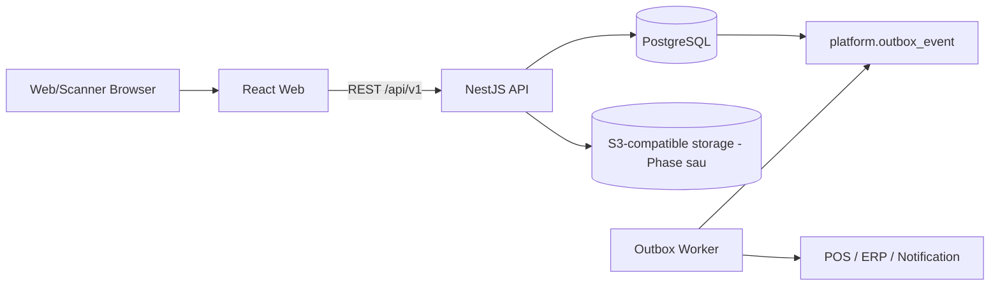
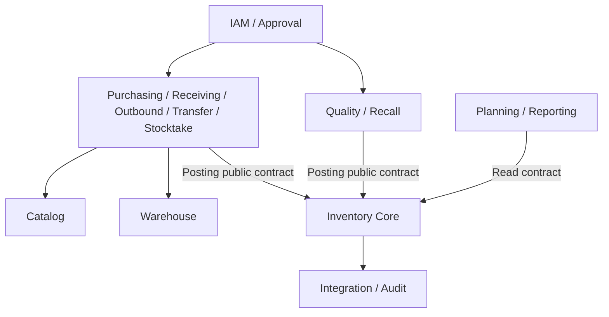
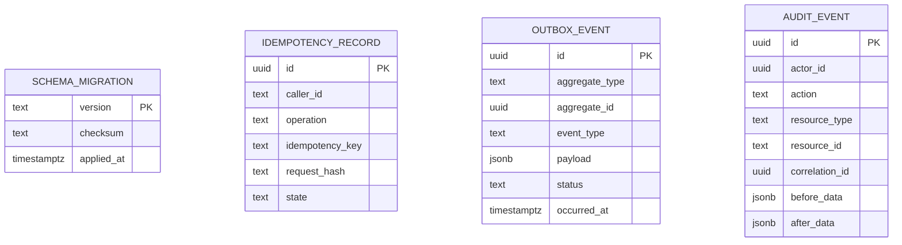

# Phase 2 Architecture Foundation

## 1. Kết luận kiến trúc

MVP dùng modular monolith NestJS, một PostgreSQL database và worker riêng đọc transactional outbox. React web gọi REST `/api/v1`. Một codebase và một chu kỳ deploy giúp đội ba người giảm overhead, trong khi module boundary và public contract giữ khả năng tách service sau này.

Kho vận hành bán sỉ nguyên kiện. `quantity` trong domain là số nguyên thùng/két/keg; số chai/lon chỉ là thuộc tính quy cách phục vụ hóa đơn, thuế và báo cáo.

## 2. Container view

## 3. Module dependency

Quy tắc: module chỉ import `public` contract của module khác. Không import `internal`, `infrastructure` hoặc repository của module khác. Inventory Core là owner duy nhất của balance, reservation, movement và ATP.

## 4. Logical ERD foundation

Phase 2 chỉ tạo bảng platform/audit cần dùng xuyên module. Bảng IAM và Master Data được tạo ở Phase 3; Balance/Reservation/Movement được tạo ở Phase 4 sau khi invariant và concurrency test được duyệt.

## 5. Database ownership

| Schema | Owner | Giai đoạn hiện thực |
|---|---|---|
| `platform`, `audit`, `integration` | Platform | Phase 2 |
| `iam`, `catalog`, `warehouse` | IAM/Master Data | Phase 3 |
| `inventory` | Inventory Core | Phase 4 |
| `purchasing`, `receiving` | Inbound | Phase 5 |
| `outbound` | Outbound | Phase 6 |
| `transfer`, `stocktake` | Transfer/Stocktake | Phase 7 |
| `quality`, `recall` | Quality/Recall | Phase 8 |
| `planning`, `reporting` | Planning/Reporting | Phase 9 |

Migration là forward-only. File đã áp dụng không được sửa; checksum mismatch phải dừng deploy. Người điều phối integration chịu trách nhiệm thứ tự migration khi Phase 5–7 merge.

## 6. API conventions

- JSON UTF-8; timestamp ISO-8601 UTC; business date dùng `YYYY-MM-DD`.
- Thành công trả `{ data, meta: { correlationId, timestamp } }`.
- Lỗi dùng `application/problem+json` và mã ổn định trong `ProblemDetails`.
- `X-Correlation-Id` có trên mọi request/response; server sinh UUID nếu client bỏ trống.
- Command ghi sổ bắt buộc `Idempotency-Key` 16–128 ký tự.
- Cùng caller + operation + key + payload trả lại kết quả cũ; cùng key khác payload trả `409 IDEMPOTENCY_CONFLICT`.
- Pagination dùng cursor cho ledger lớn; master data có thể dùng page/limit có giới hạn.
- Authentication dùng Bearer JWT ở Phase 3; UI không thay thế authorization server-side.

## 7. Transaction và outbox

POSTED command phải chạy trong một transaction bao gồm document state, movement, balance, reservation fulfillment, audit bắt buộc và outbox. Worker dùng `FOR UPDATE SKIP LOCKED`, retry idempotent và không được trực tiếp ghi Inventory Balance.

## 8. Security và observability baseline

- Secret chỉ qua environment/secret store; `.env` bị ignore.
- Không log password, access token, refresh token hoặc payload nhạy cảm.
- Structured log phải có service, level, correlationId, actorId, module và outcome.
- `/health` là liveness; readiness có kiểm tra database sẽ bổ sung khi API database module được nối.
- Audit là append-only và application path không có quyền UPDATE/DELETE.
- Production image chạy non-root; dependency/security scan nằm trong CI khi lockfile được tạo.

## 9. Quyết định chưa được giả mạo là hoàn tất

- Identity Provider, hạ tầng cloud/on-premise và object storage vendor còn cần stakeholder xác nhận.
- Giá trị `minimum_inbound_quantity`/`minimum_outbound_quantity` từng SKU chưa có dữ liệu thật.
- Inventory row-lock strategy được spike và test đầy đủ tại Phase 4; Phase 2 chỉ chốt khả năng explicit transaction/lock của PostgreSQL.
